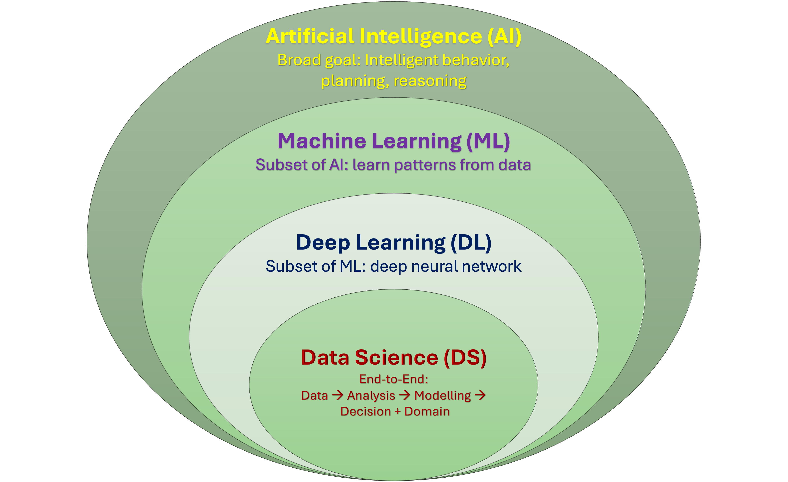
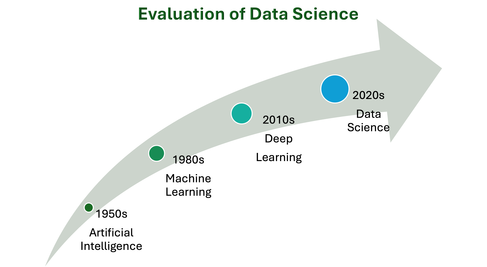
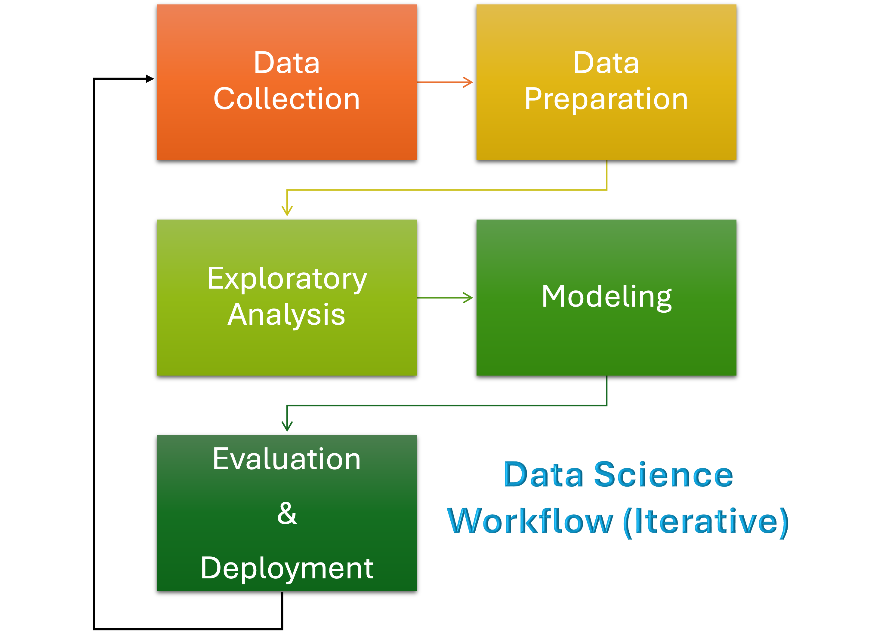

# 📘 Chapter 1 — Introduction

> Understanding the relationship among **Artificial Intelligence (AI)**, **Machine Learning (ML)**, and **Data Science (DS)** — their evolution, importance, and real-world impact.

---

## 1. Relation among AI, ML, and Data Science

### Conceptual Overview
Artificial Intelligence (AI) is the broadest field, aiming to create systems capable of intelligent behavior.  

Machine Learning (ML) is a subset of AI that focuses on algorithms that learn patterns from data.  
Data Science (DS) integrates **statistics**, **data analysis**, and **ML** to extract insights and build predictive models.

The hierarchical relationship can be expressed as:

\[ \text{Data Science} \subseteq (\text{Machine Learning}) \subseteq (\text{Artificial Intelligence}) \]

This relationship is visualized as follows:

---

### Mathematical View
Data Science involves modeling real-world processes mathematically:

\[ Y = f(X) + \varepsilon \]

Where:  
- \(X\) = Input features or observed data  
- \(Y\) = Target variable or output  
- \(f(X)\) = Learned function (model)  
- \(\varepsilon\) = Random noise or error term

**Example:** 
Predicting house prices — \( Y = f(\text{area, rooms, location}) + \varepsilon \)

---

## 2. Evolution of Data Science

The discipline evolved through several key phases, blending statistics, computing, and AI:

| Era | Focus | Key Development |
|------|--------|----------------|
| **1950s** | Artificial Intelligence | Symbolic reasoning, rule-based systems |
| **1980s** | Machine Learning | Statistical learning, neural networks |
| **2010s** | Deep Learning | GPU-driven deep neural networks |
| **2020s** | Data Science | Unified approach: data + ML + domain knowledge |

**Timeline Visualization:**

---

## 3. Importance of Data Science

Data Science lies at the intersection of **mathematics**, **programming**, and **domain expertise**.  
It powers modern decision-making, enabling organizations to:

- Detect patterns in large-scale data  
- Automate predictions and recommendations  
- Optimize resources and operations  
- Support data-driven policies and research

### Data Science Workflow

**Key Steps:**
1. **Data Collection** — Gather raw structured and unstructured data  
2. **Data Preparation** — Handle missing values, noise, and inconsistencies  
3. **Exploratory Analysis** — Visualize and understand distributions  
4. **Modeling** — Apply ML/statistical models to learn relationships  
5. **Evaluation & Deployment** — Assess accuracy and deploy results  
6. **Iteration** — Feedback loop for model improvement  

---

## 4. Real-world Examples

| Domain | Application | Description |
|---------|--------------|--------------|
| Healthcare | Disease Prediction | ML models identify risk factors for diseases |
| Finance | Fraud Detection | Anomaly detection on transaction data |
| Marketing | Recommendation Systems | Suggest personalized products using user data |
| IoT | Predictive Maintenance | Sensors predict equipment failures |
| Research | Climate Modeling | Data analysis for environmental forecasts |

---

## Summary

- **AI** aims for intelligent behavior.  
- **ML** enables systems to learn from data.  
- **Data Science** applies these methods to extract actionable insights.  
- Its iterative process ensures continuous improvement and generalization.

---
