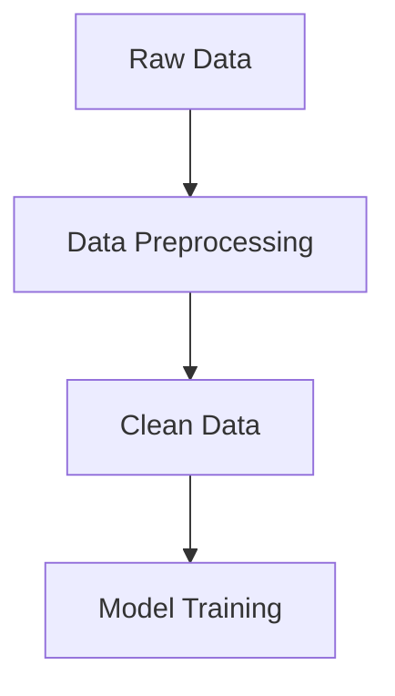
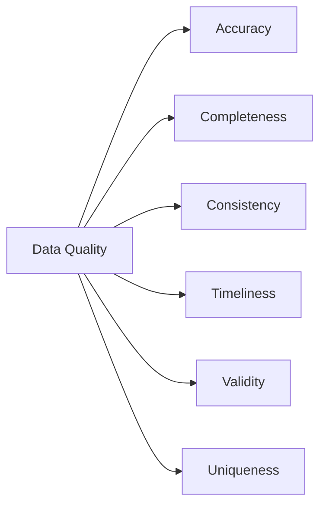
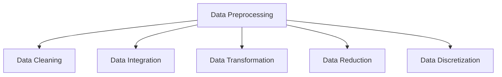
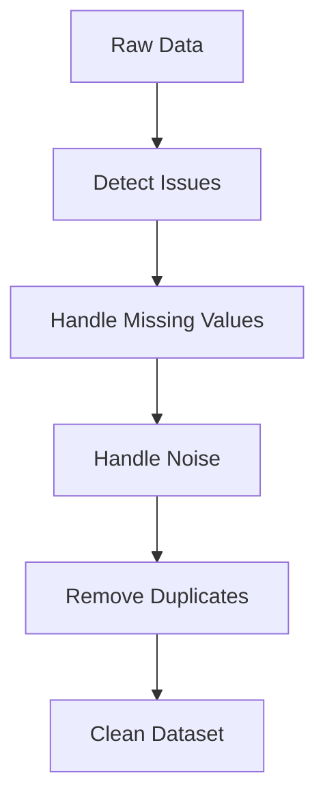
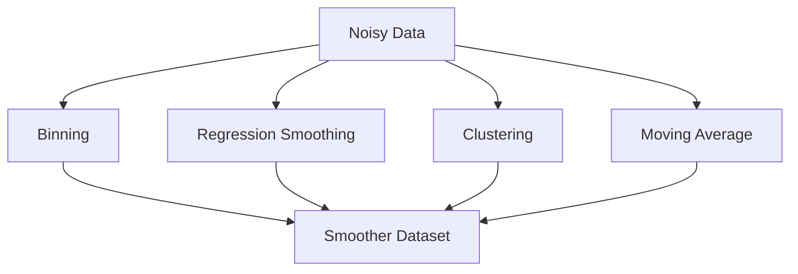
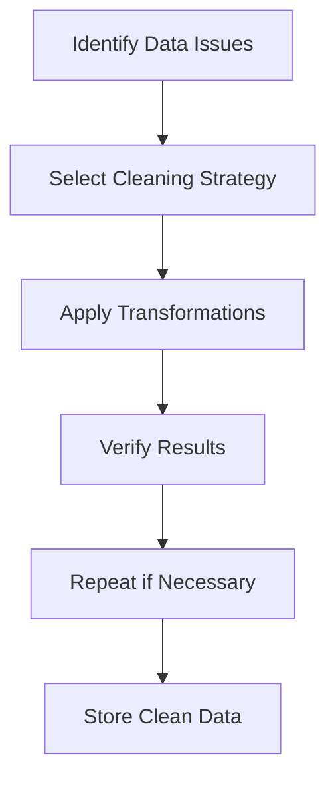
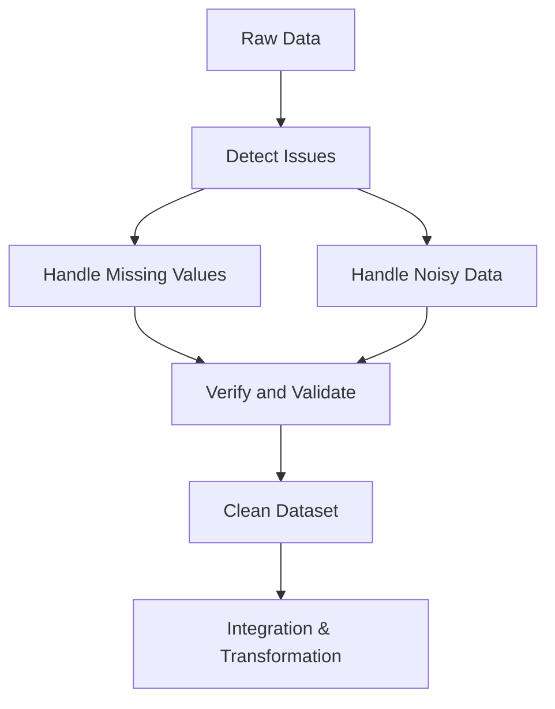

# 🧹 Chapter 10 — Data Preprocessing

> This chapter explains **data quality issues** and the essential steps in **data preprocessing** including cleaning, handling missing values, and noise reduction.

---

## 🧠 1. Why Preprocess the Data?

Raw data is rarely perfect. It may contain **missing values**, **inconsistencies**, **noise**, or **outliers**. Data preprocessing ensures the dataset is **accurate, complete, and consistent** before modeling.

### Key Reasons
1. **Improved Model Accuracy** — Clean data leads to better predictions.
2. **Reduced Complexity** — Simplifies data for analysis.
3. **Error Minimization** — Prevents misleading results due to poor data quality.
4. **Better Interpretability** — Makes outputs meaningful to domain experts.

---

## ⚙️ 2. Data Quality Dimensions

| Dimension | Description | Example Issue |
|------------|-------------|----------------|
| Accuracy | Correctness of data | Age recorded as 250 |
| Completeness | Missing values or records | Null entries in income |
| Consistency | Uniform format or scale | “USA” vs “United States” |
| Timeliness | Up‑to‑date data | Using 2010 sales for 2025 analysis |
| Validity | Follows rules and constraints | Negative quantity sold |
| Uniqueness | Duplicate entries | Same customer twice |

---

## 🧩 3. Major Tasks in Data Preprocessing

The main stages include:

| Task | Description | Example |
|------|--------------|----------|
| Data Cleaning | Handle noise, missing, inconsistent data | Replace nulls, smooth noise |
| Data Integration | Combine data from multiple sources | Join customer and sales tables |
| Data Transformation | Normalize or encode | Min‑max scaling, one‑hot encoding |
| Data Reduction | Reduce volume while maintaining integrity | PCA, feature selection |
| Data Discretization | Convert continuous to categorical | Income ranges: low/medium/high |

---

## 🧼 4. Data Cleaning

### 4.1 What is Data Cleaning?

**Data Cleaning** is the process of detecting and correcting (or removing) corrupt or inaccurate records from a dataset.

---

## 🚧 5. Handling Missing Values

### 5.1 Common Causes
- Human errors during data entry  
- Sensor or transmission failures  
- Non‑responses in surveys  

### 5.2 Strategies

| Method | Description | Example |
|--------|--------------|----------|
| Ignore tuple | Remove records with missing values | Drop rows with `NaN` |
| Global constant | Fill with a fixed value | Replace null with “Unknown” |
| Mean/Median/Mode | Use statistical measures | Fill income with mean value |
| Predictive | Use model‑based imputation | Regression or k‑NN |
| Domain‑based | Use rules from domain | Age = avg for that region |

#### Manual Example

| Record | Age | Income |
|---------|-----|--------|
| A | 25 | 60K |
| B | NaN | 50K |
| C | 30 | NaN |

**Mean Age** = (25+30)/2 = 27.5  
**Mean Income** = (60+50)/2 = 55K

| Record | Age | Income |
|---------|-----|--------|
| A | 25 | 60K |
| B | 27.5 | 50K |
| C | 30 | 55K |

---

## 🔊 6. Handling Noisy Data

### 6.1 Definition
**Noisy data** contains random errors, deviations, or outliers that distort patterns.

### 6.2 Noise Reduction Techniques

| Technique | Description | Example |
|------------|-------------|----------|
| Binning | Sort data and smooth using bins | Group ages 20‑29, 30‑39 |
| Regression | Fit model to remove deviations | Linear regression smoothing |
| Clustering | Group similar data | Remove far‑away outliers |
| Moving Average | Smooth temporal fluctuations | Stock price smoothing |

### Manual Example — Binning
Data: [5, 6, 7, 10, 12, 13, 20]  
Sort and divide into 3 bins:  
- Bin1: [5,6,7] → mean=6  
- Bin2: [10,12,13] → mean=11.67  
- Bin3: [20] → mean=20  
Smoothed data: [6,6,6,11.67,11.67,11.67,20]

---

## 🧮 7. Data Cleaning as a Process

The cleaning process involves multiple iterative passes:

| Step | Action | Output |
|------|---------|---------|
| Identify | Detect missing/outlier values | Report summary |
| Strategy | Choose imputation or removal | Decision plan |
| Apply | Execute cleaning rules | Updated dataset |
| Verify | Compare stats pre/post cleaning | Quality metrics |
| Store | Save clean data for analysis | Ready data file |

---

## 📈 8. Summary Diagram

---

## 🧠 9. Key Takeaways

- Data preprocessing is vital for reliable modeling.  
- Major steps include **cleaning, integration, transformation, reduction,** and **discretization**.  
- Handling **missing** and **noisy data** is critical for data quality.  
- Cleaning is an **iterative** and **domain‑driven** process.  

---

## 📘 10. Exam Practice Questions

1. **What are the main reasons for preprocessing data?**
2. **Describe at least three techniques for handling missing values.**  
3. **Explain the concept of noisy data with examples.** 
4. **Outline the stages of the data cleaning process.**
5. **Why is iterative cleaning important in real‑world data science projects?**

---

