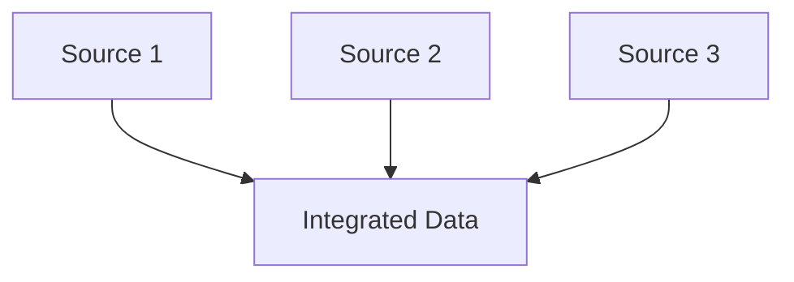
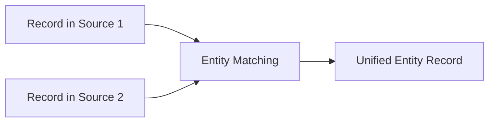
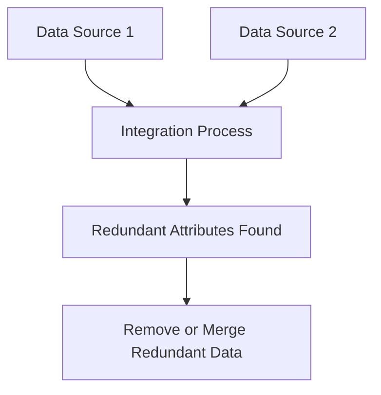
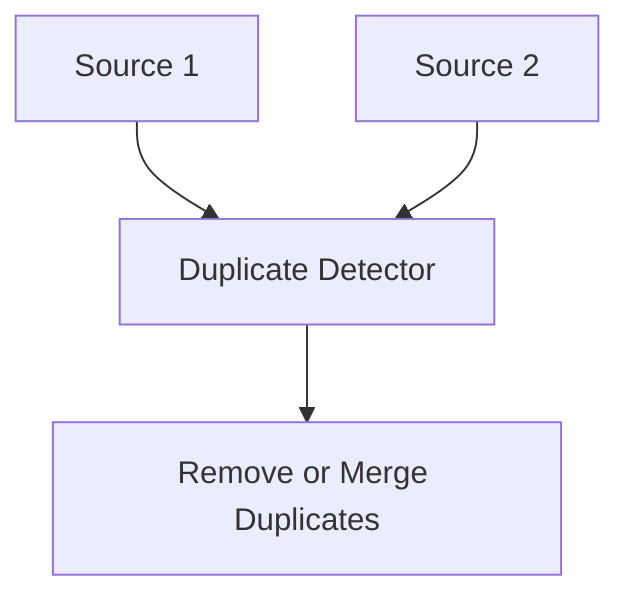
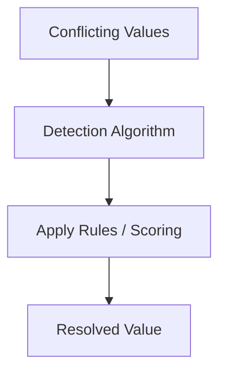
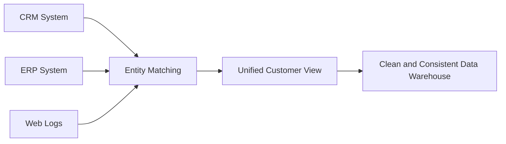

# 🧩 Chapter 11 — Data Integration

> This chapter explains **Data Integration**, focusing on entity identification, redundancy and correlation analysis, tuple duplication, and data value conflict resolution.

---

## 🔗 1. What is Data Integration?

**Data Integration** is the process of combining data from multiple sources into a unified and consistent view.  
It’s crucial for analytical systems that rely on data from heterogeneous sources (e.g., databases, files, APIs).



### Example
- Integrating customer data from **CRM**, **ERP**, and **web analytics** systems.  
- Ensures consistent customer IDs, names, and contact details across all sources.

---

## 🧠 2. The Entity Identification Problem

### Definition
The **Entity Identification Problem** (also called **Record Linkage** or **Entity Resolution**) occurs when the same real-world entity appears under different names or identifiers across datasets.

| Example | System A | System B |
|----------|-----------|-----------|
| Customer Name | “John Smith” | “J. A. Smith” |
| Customer ID | 1452 | CUST‑001452 |
| Address | 12 Oak Rd, NY | 12 Oak Road, New York |

The challenge is to determine whether these records refer to the **same entity**.



### Solutions
1. **Rule‑based matching** — exact or fuzzy string matching.  
2. **Machine Learning approaches** — classify record pairs as “same/different.”  
3. **Unique key assignment** — generate global identifiers.  

---

## 🔁 3. Redundancy and Correlation Analysis

### 3.1 Redundancy

**Redundancy** refers to duplicate or repetitive data that doesn’t add new information.  
It wastes storage and may bias statistical analysis.

| Example | Redundant Data |
|----------|----------------|
| Customer table | Repeated address field |
| Joined tables | Duplicate keys after merge |



### 3.2 Correlation Analysis

**Correlation analysis** helps identify relationships between variables to remove redundant attributes.

Mathematically, for attributes $X$ and $Y$:

\[ r_{XY} = \frac{\sum_i (x_i - \bar{x})(y_i - \bar{y})}
{\sqrt{\sum_i (x_i - \bar{x})^2 \sum_i (y_i - \bar{y})^2}} \]

If $|r_{XY}|$ ≈ 1 → strong correlation → one attribute may be redundant.

| X | Y | (X–mean) | (Y–mean) | Product |
|---|---|-----------|-----------|----------|
| 1 | 2 | -1 | -2 | 2 |
| 2 | 3 | 0 | -1 | 0 |
| 3 | 4 | +1 | 0 | 0 |
| Mean | 2 | 3 | — | — |
|$$ r_{XY} $$ | | | | ≈ 1 |

---

## 🧬 4. Tuple Duplication

### Definition
**Tuple duplication** occurs when the same data record appears multiple times in a dataset, either within or across sources.



### Causes
- Repeated data imports  
- Manual data entry  
- Join operations without distinct filters  

### Detection & Removal
| Method | Description |
|--------|--------------|
| Exact matching | Compare full tuples |
| Key-based | Check duplicate primary keys |
| Hash-based | Use hash functions for large datasets |
| Clustering | Group similar tuples |

### Example
| ID | Name | City |
|----|------|------|
| 1 | John | NY |
| 2 | Alice | TX |
| 1 | John | NY |

→ Duplicate tuple (ID=1).  

**SQL Example:**
```sql
SELECT Name, City, COUNT(*) 
FROM Customers
GROUP BY Name, City
HAVING COUNT(*) > 1;
```

---

## ⚖️ 5. Data Value Conflict Detection and Resolution

### Definition
Occurs when the same entity has **different attribute values** in different data sources.

| Source | Customer | City |
|---------|-----------|------|
| CRM | John Doe | “New York” |
| ERP | John Doe | “NYC” |

### Detection
- Compare same‑entity attributes across sources.  
- Use **string similarity** (e.g., Levenshtein distance) or **standardized dictionaries**.

### Resolution Strategies

| Strategy | Description | Example |
|-----------|-------------|----------|
| Rule-based | Apply business rules | Prefer ERP data for “City” |
| Confidence score | Assign trust levels to sources | Weight by reliability |
| Most recent | Use timestamp to pick latest | Choose data from latest update |
| Merge | Combine differing values | City = “New York (NYC)” |



---

## 🧩 6. Example Integration Scenario



### Step‑wise Illustration

| Step | Operation | Result |
|------|------------|--------|
| 1 | Match “John Smith” across systems | Entity identified |
| 2 | Remove duplicates | Unique records |
| 3 | Resolve city conflicts | “New York” unified |
| 4 | Remove redundant fields | Reduced schema |
| 5 | Store unified customer data | Ready for analytics |

---

## 🧠 7. Summary Table

| Task | Description | Techniques |
|------|--------------|------------|
| Entity Identification | Match entities across sources | String similarity, ML classification |
| Redundancy Analysis | Detect duplicated data or attributes | Correlation, schema mapping |
| Tuple Duplication | Detect repeated records | Hashing, grouping, clustering |
| Conflict Resolution | Resolve conflicting values | Rule-based, timestamp, confidence weight |

---

## 📘 8. Practice Questions

1. **Define the Entity Identification Problem and explain its challenges.**  
2. **How does correlation analysis help in reducing redundancy?**  
3. **Explain tuple duplication with SQL and manual examples.**  
4. **What are common strategies for data conflict resolution?**  
5. **Why is integration critical in enterprise data warehouses?**  

---

