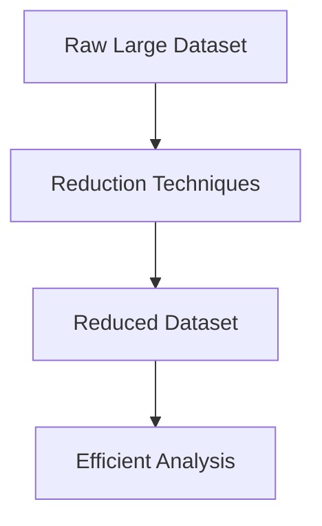
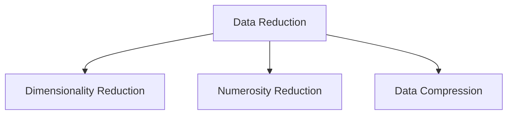
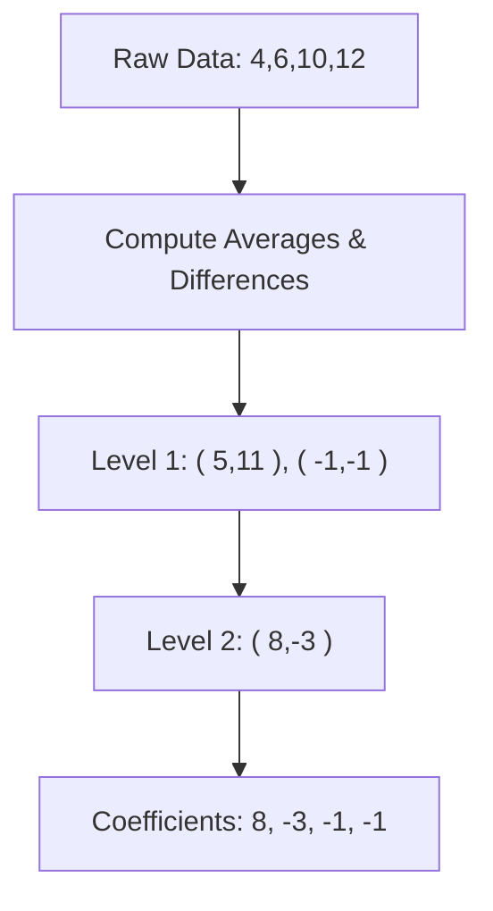
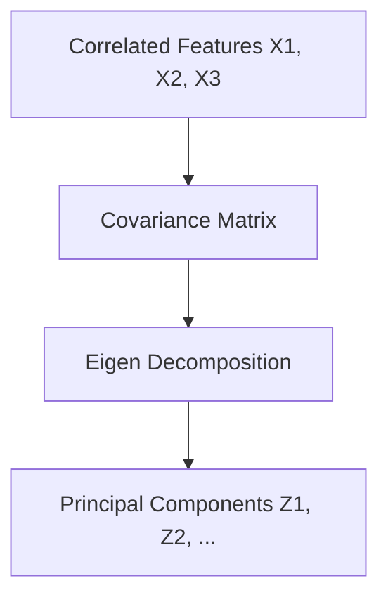
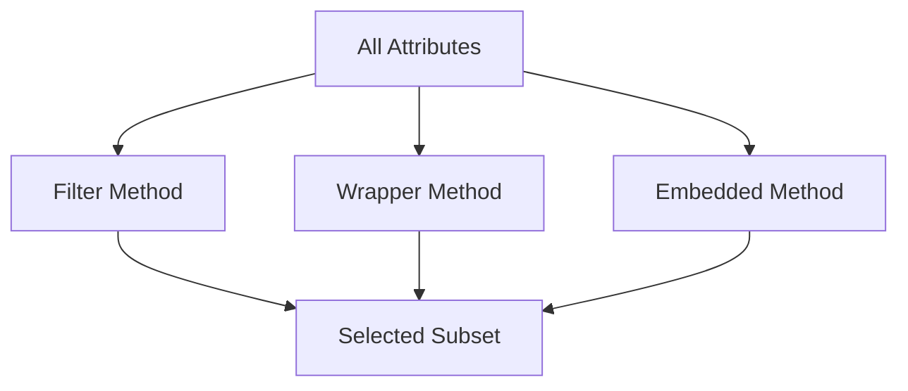

# 📉 Chapter 12 — Data Reduction

> This chapter explores the need for **Data Reduction**, its strategies, and key techniques like **Wavelet Transformation**, **Principal Component Analysis (PCA)**, and **Attribute Subset Selection**.

---

## 🔁 1. Overview of Data Reduction

**Data Reduction** aims to obtain a reduced representation of a dataset that is smaller in volume but produces almost the same analytical results.

### Why Data Reduction?
- To **reduce storage and computation costs**
- To **improve algorithm efficiency**
- To **eliminate redundant or irrelevant features**
- To **enhance interpretability** without losing essential information

---

## 🧩 2. Strategies for Data Reduction

| Strategy | Description | Example Techniques |
|-----------|-------------|--------------------|
| **Data Cube Aggregation** | Summarize data at multiple granularities | Roll-up operations in OLAP |
| **Dimensionality Reduction** | Reduce number of attributes | PCA, Feature selection |
| **Numerosity Reduction** | Replace data with smaller models | Clustering, Regression models |
| **Data Compression** | Encode data efficiently | Wavelet transform, Huffman coding |

---

## 🌊 3. Wavelet Transformation

### Definition
The **Wavelet Transform** decomposes data into components of different frequency sub-bands — offering both **time** and **frequency** information.

Unlike the Fourier Transform, which uses only sine and cosine waves, Wavelets use **localized basis functions**.

### 3.1 Mathematical Concept

A signal \( f(t) \) can be represented as:
$f(t) = \sum_{j,k} c_{j,k} \, \psi_{j,k}(t)$

where  
- \( \psi_{j,k}(t) \) are **wavelet basis functions** at scale *j* and translation *k*  
- \( c_{j,k} \) are **wavelet coefficients**.

### 3.2 Example — Haar Wavelet Transformation

**Original Data:** [4, 6, 10, 12]

1. Pairwise averages and differences:  
   - Level 1 Averages: [(4+6)/2, (10+12)/2] = [5, 11]  
   - Level 1 Differences: [(4−6)/2, (10−12)/2] = [−1, −1]

2. Repeat on averages:  
   - Level 2 Average: (5+11)/2 = 8  
   - Level 2 Difference: (5−11)/2 = −3

**Wavelet Coefficients:** [8, −3, −1, −1]

Wavelet coefficients provide a **compressed representation** while retaining key trends.

---

## 🧮 4. Principal Component Analysis (PCA)

### 4.1 Purpose

**PCA** reduces dimensionality by transforming correlated features into a new set of **uncorrelated variables (principal components)** that capture maximum variance.

### 4.2 Mathematical Steps

Given data matrix \( X \) (n samples × p features):

1. **Standardize** data:  
   $x'_{ij} = \frac{x_{ij} - \mu_j}{\sigma_j}$
2. **Compute covariance matrix:**  
   $C = \frac{1}{n-1} X^T X$
3. **Find eigenvalues and eigenvectors:**  
   $C v_i = \lambda_i v_i$
4. **Sort eigenvalues** in descending order → select top *k* components.
5. **Project data:**  
   $Z = X V_k$

where \(V_k\) contains eigenvectors of top *k* eigenvalues.

### 4.3 Example (by hand)

Data (2D): 

| X1 | X2 |
|----|----|
| 2.5 | 2.4 |
| 0.5 | 0.7 |
| 2.2 | 2.9 |
| 1.9 | 2.2 |
| 3.1 | 3.0 |
| 2.3 | 2.7 |
| 2.0 | 1.6 |
| 1.0 | 1.1 |
| 1.5 | 1.6 |
| 1.1 | 0.9 |

Covariance matrix:  
$$
C = \begin{bmatrix}
0.6166 & 0.6154 \\
0.6154 & 0.7166
\end{bmatrix}
$$

Eigenvalues: 1.284, 0.049  
→ First principal component captures **96% variance**.  
→ One dimension (Z1) is enough to represent data.

---

## 🧠 5. Attribute Subset Selection

### Definition

Select the **most relevant attributes** to preserve predictive power while reducing redundancy.

### 5.1 Methods

| Method | Description | Example |
|--------|--------------|----------|
| **Filter** | Use statistical tests independent of model | Correlation, Chi‑square |
| **Wrapper** | Evaluate subsets using model performance | Forward/backward selection |
| **Embedded** | Feature selection occurs during training | LASSO, Decision tree importance |

### 5.2 Example — Backward Elimination

1. Start with all features: F1, F2, F3, F4  
2. Remove one with least contribution to model accuracy  
3. Repeat until no improvement

---

## 🧩 6. Comparison of Reduction Techniques

| Technique | Purpose | Output | Example Tool |
|------------|----------|--------|---------------|
| Wavelet Transform | Compress numeric data | Coefficients | MATLAB, PyWavelets |
| PCA | Reduce correlated features | Principal components | scikit‑learn |
| Attribute Subset Selection | Choose best predictors | Selected columns | Weka, Python sklearn |

---

## 📘 7. Practice Questions

1. **Explain how wavelet transformation achieves data compression.**  
2. **Derive the PCA transformation mathematically.**  
3. **Distinguish between numerosity reduction and dimensionality reduction.**  
4. **Compare filter, wrapper, and embedded feature selection methods.**  
5. **Compute the first principal component for a 2D dataset manually.**  

---

