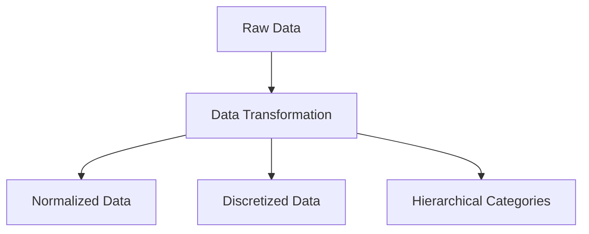
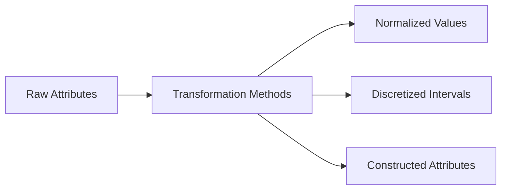
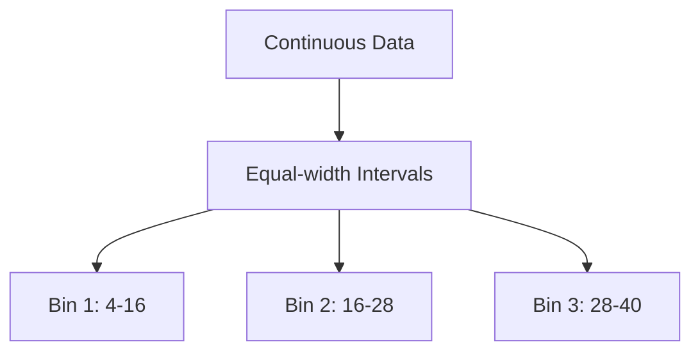
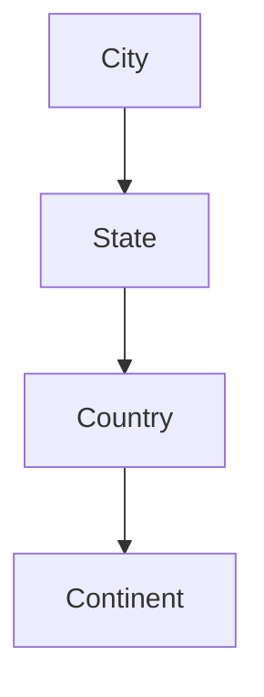

# 🔄 Chapter 13 — Data Transformation and Discretization

> This chapter explores **data transformation strategies**, **normalization**, **discretization by binning**, and **concept hierarchy generation** for nominal data.

---

## ⚙️ 1. Overview of Data Transformation

**Data Transformation** converts data into an appropriate format or structure for analysis.  
It improves data quality and makes algorithms more efficient and comparable.

### Objectives
- Scale numeric data into comparable ranges  
- Reduce noise and variation  
- Improve model convergence  
- Simplify representation (e.g., categorical grouping)

---

## 📏 2. Data Transformation Strategies

| Transformation Type | Description | Example |
|----------------------|--------------|----------|
| **Smoothing** | Remove noise from data | Moving averages |
| **Aggregation** | Summarize values | Weekly → monthly sales |
| **Generalization** | Replace detailed data with higher-level concepts | “Student Age” → “Age Group” |
| **Normalization** | Scale data to fixed range | [0,1] scaling |
| **Discretization** | Convert continuous to categorical | Age → Young, Middle, Old |
| **Attribute Construction** | Create new derived features | BMI = weight/height² |

---

## 📉 3. Data Transformation by Normalization

### Definition
**Normalization** adjusts numeric data to a common scale without distorting differences in ranges or distributions.

### 3.1 Min–Max Normalization
Maps data into the range [0,1]:  

\[ x' = \frac{x - \min(x)}{\max(x) - \min(x)} \]

**Example:**  
Given values [10, 15, 20, 25], normalize 20.

$$x' = \frac{20 - 10}{25 - 10} = \frac{10}{15} = 0.667$$

| Original | Normalized |
|-----------|-------------|
| 10 | 0.0 |
| 15 | 0.33 |
| 20 | 0.67 |
| 25 | 1.0 |

---

### 3.2 Z‑Score Normalization
Standardizes data using mean (μ) and standard deviation (σ):  

$$ x' = \frac{x - \mu}{\sigma} $$

**Example:**  
x = 50, μ = 40, σ = 5  
→ \( x' = (50 - 40) / 5 = 2.0 \)

| Original | Z‑score |
|-----------|----------|
| 30 | −2 |
| 40 | 0 |
| 50 | +2 |

---

### 3.3 Decimal Scaling Normalization
Moves the decimal point of values to bring them within [−1,1]:  

$$ x' = \frac{x}{10^j}$$

where *j* = smallest integer such that max(|x'|) < 1

**Example:**  
x = 345 → \( x' = 0.345 \) since j = 3

---

## 🔢 4. Discretization by Binning

### Definition
**Discretization** converts continuous attributes into categorical intervals (bins).  
It helps reduce small observation effects and simplify patterns.

### 4.1 Types of Binning

| Type | Description | Example |
|------|--------------|----------|
| **Equal‑width** | Divide range into equal intervals | 0–10, 10–20, 20–30 |
| **Equal‑frequency** | Each bin has equal number of samples | 5 per bin |
| **Supervised** | Bins chosen based on class labels | Decision tree splits |

---

### 4.2 Example — Equal‑width Binning

Data: [4, 8, 15, 21, 24, 25, 28, 34, 35, 40]

Range = 40 − 4 = 36  
If 3 bins → Bin width = 36 / 3 = 12

| Bin | Interval | Values |
|-----|-----------|--------|
| 1 | [4–16) | 4, 8, 15 |
| 2 | [16–28) | 21, 24, 25 |
| 3 | [28–40] | 28, 34, 35, 40 |

### 4.3 Smoothing by Binning
Within each bin, replace values by:
- **Bin mean** (average)
- **Bin median**
- **Bin boundary values**

Example (Bin 1 = [4, 8, 15])  
→ Mean smoothing: replace with 9 (average)

Smoothed data: [9, 9, 9, 23, 23, 23, 34, 34, 34, 34]

---

## 🧭 5. Concept Hierarchy Generation for Nominal Data

### Definition
For categorical attributes, data can be organized into **concept hierarchies** that represent levels of abstraction.

### 5.1 Example — Location Hierarchy

| Level | Example |
|--------|----------|
| City | Hyderabad |
| State | Telangana |
| Country | India |
| Continent | Asia |

### 5.2 Hierarchy Generation Methods
| Approach | Description | Example |
|-----------|-------------|----------|
| **Explicit specification** | Defined by domain expert | City → State → Country |
| **Automatic generation** | Derived from data attributes | ZIP → City → Region |
| **Schema-based** | Based on database schema | Employee_ID → Department → Division |

---

## 🧠 6. Summary Table

| Process | Purpose | Techniques |
|----------|----------|------------|
| Transformation | Adjust data scale or distribution | Normalization, smoothing |
| Normalization | Scale numeric attributes | Min–max, Z‑score, Decimal scaling |
| Discretization | Convert numeric to categorical | Binning, decision tree splits |
| Concept Hierarchy | Abstract categorical data | City→State→Country |

---

## 📘 7. Practice Questions

1. **Explain the importance of data transformation before modeling.**  
2. **Derive the formula for Z‑score normalization and compute for x=70, μ=50, σ=10.**  
3. **Perform equal‑width binning for the dataset [3,5,7,9,11,13,15] into 2 bins.**  
4. **Differentiate between equal‑width and equal‑frequency discretization.**  
5. **Draw a concept hierarchy for “Product Category” (e.g., Item → Type → Department → Store).**  

---

