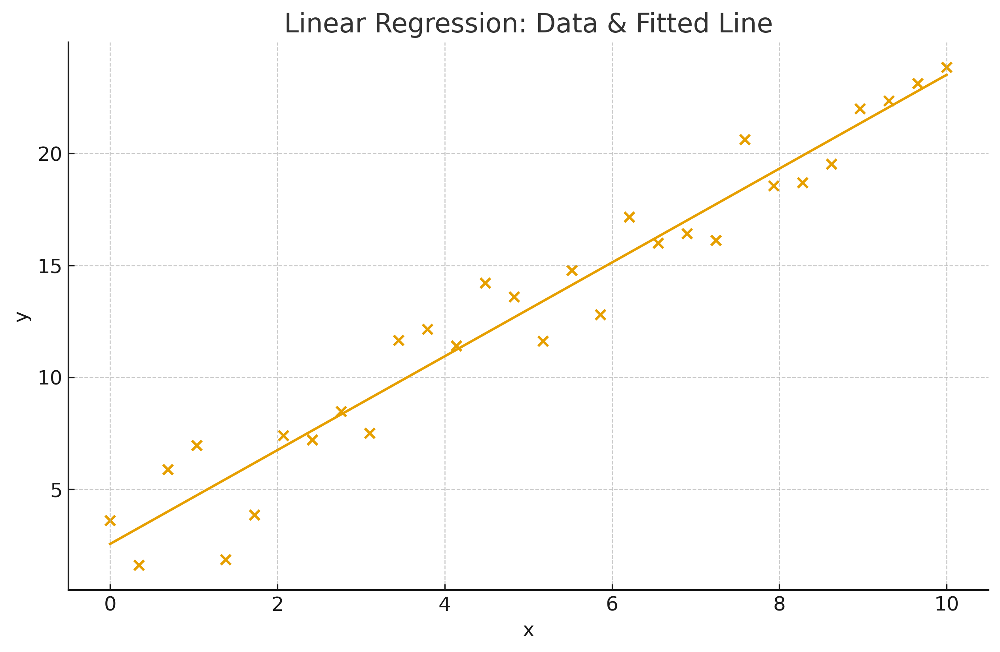
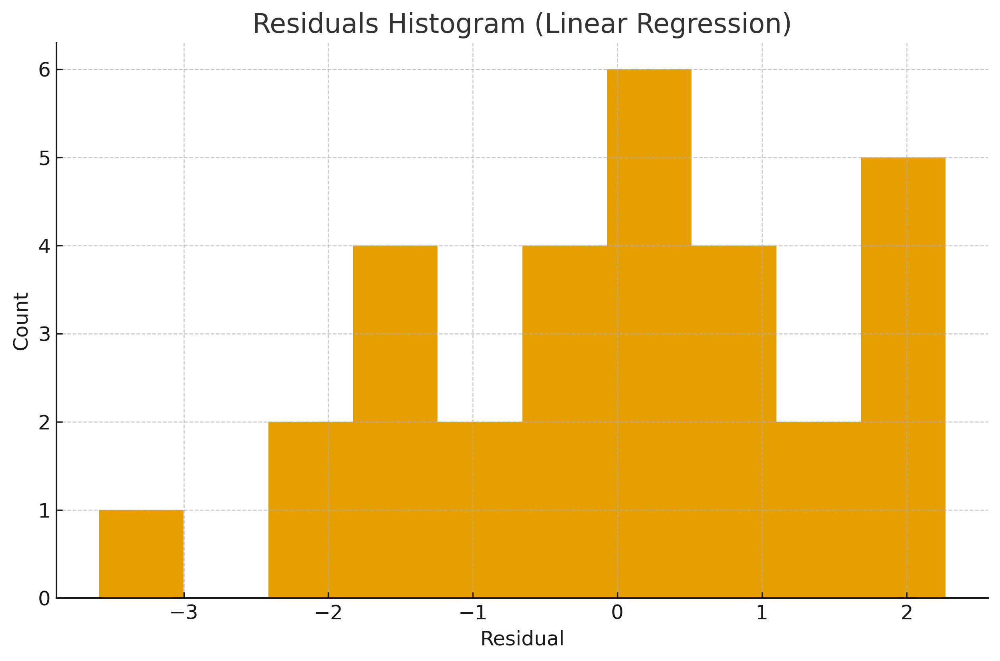
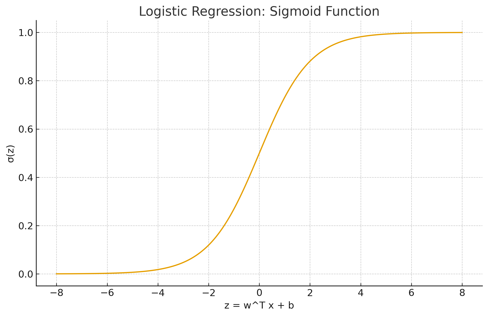

# 📘 Chapter 14 — Regression

> **Goal:** Understand Linear Regression and Logistic Regression (for classification), and master core regression metrics: **MAE, MSE, RMSE, R²**. Includes theory, math, by-hand examples.

---

## 1) Linear Regression

### 1.1 Problem Setup
Given data points \((x_i, y_i)\) for \(i=1,\dots,n\), fit a line
$$ \hat y_i = \beta_0 + \beta_1 x_i $$
that minimizes the **sum of squared errors** (SSE):
$$ \text{SSE}(\beta_0,\beta_1) = \sum_{i=1}^n (y_i - \beta_0 - \beta_1 x_i)^2 . $$

### 1.2 Closed-Form (Normal Equations)
Let \(\bar x\) and \(\bar y\) be sample means.
$$ \hat\beta_1 = \frac{\sum_i (x_i-\bar x)(y_i-\bar y)}{\sum_i (x_i-\bar x)^2}, \qquad
\hat\beta_0 = \bar y - \hat\beta_1 \bar x . $$

**Matrix form:** with \(X = [\,x\ \ 1\,]\) and \(y \in \mathbb{R}^n\),
$$ \hat{\boldsymbol\beta} = (X^\top X)^{-1} X^\top y,\quad \boldsymbol\beta = \begin{bmatrix}\beta_1\\ \beta_0\end{bmatrix}. $$

### 1.3 By-Hand Example (tiny dataset)
Data: \((x,y) \in \{(1,2),(2,3),(3,5),(4,4),(5,7)\}\).  
Compute means: \(\bar x=3,\ \bar y=4.2\).

\(\sum (x-\bar x)(y-\bar y) = 11.0\) and \(\sum (x-\bar x)^2=10\).  
So \(\hat\beta_1 = 11/10 = 1.1\).  
\(\hat\beta_0 = 4.2 - 1.1\cdot 3 = 0.9\).  
**Fitted line:** \(\hat y = 0.9 + 1.1x\).

Now compute predictions and residuals:

$$ \begin{array}{c|ccccc}
x & 1 & 2 & 3 & 4 & 5 \\\hline
y & 2 & 3 & 5 & 4 & 7 \\
\hat y & 2.0 & 3.1 & 4.2 & 5.3 & 6.4 \\
e=y-\hat y & 0.0 & -0.1 & 0.8 & -1.3 & 0.6
\end{array} $$

### 1.4 Visuals

---

## 2) Logistic Regression (for Classification)

### 2.1 Model
For binary \(y\in\{0,1\}\), logistic regression models the **log-odds** via a linear function:
$$ \log\frac{p(y=1\mid \mathbf x)}{1-p(y=1\mid \mathbf x)} = \mathbf w^\top \mathbf x + b, $$
so that
$$ p(y=1\mid \mathbf x) = \sigma(\mathbf w^\top \mathbf x + b) = \frac{1}{1+e^{-(\mathbf w^\top \mathbf x + b)}} . $$
Decision rule (default): predict \(1\) if \(p \ge 0.5\), else \(0\).

### 2.2 Maximum Likelihood & Loss
Given data \(\{(\mathbf x_i,y_i)\}\), the (negative) log-likelihood
$$ \mathcal L(\mathbf w,b)= -\sum_{i=1}^n \Big[y_i\log \sigma(z_i) + (1-y_i)\log(1-\sigma(z_i))\Big],\quad z_i=\mathbf w^\top \mathbf x_i + b. $$
Minimize \(\mathcal L\) using gradient-based optimization.

### 2.3 Visual

---

## 3) Regression Metrics

Given true values \(y_i\) and predictions \(\hat y_i\):

### 3.1 Mean Absolute Error (MAE)
$$ \text{MAE} = \frac{1}{n}\sum_{i=1}^n |y_i - \hat y_i| . $$

### 3.2 Mean Squared Error (MSE)
$$ \text{MSE} = \frac{1}{n}\sum_{i=1}^n (y_i - \hat y_i)^2 . $$

### 3.3 Root Mean Squared Error (RMSE)
$$ \text{RMSE} = \sqrt{\text{MSE}} . $$

### 3.4 Coefficient of Determination (R²)
Let \(\bar y=\frac{1}{n}\sum_i y_i\). 

Define
\(\text{SS}_{{tot}}=\sum_i (y_i-\bar y)^2\) and \(\text{SS}_{{res}}=\sum_i (y_i-\hat y_i)^2\).

$$ R^2 = 1 - \frac{\text{SS}_{{res}}}{\text{SS}_{{tot}}} . $$

### 3.5 By-Hand Metric Example
Using the tiny dataset and the fitted line \(\hat y=0.9+1.1x\):
$\begin{array}{c|ccccc}
x & 1 & 2 & 3 & 4 & 5 \\  \hline
y & 2 & 3 & 5 & 4 & 7 \\
\hat y & 2.0 & 3.1 & 4.2 & 5.3 & 6.4 \\
|e| & 0.0 & 0.1 & 0.8 & 1.3 & 0.6 \\
e^2 & 0.0 & 0.01 & 0.64 & 1.69 & 0.36
\end{array}$

\(\text{MAE}=(0+0.1+0.8+1.3+0.6)/5=0.56\).  
\(\text{MSE}=(0+0.01+0.64+1.69+0.36)/5=0.54\).  
\(\text{RMSE}=\sqrt{0.54}=0.735\).  
\(\bar y=4.2\Rightarrow \text{SS}_{{tot}}=14.8\), \(\text{SS}_{{res}}=5\cdot 0.54=2.7\).  
\(R^2=1-2.7/14.8=0.8189\) (≈ 0.819).

---

## 4) Practice Questions

1. Derive the OLS solution \((X^\top X)^{-1}X^\top y\) starting from SSE.  
2. Why is logistic regression optimized by maximum likelihood rather than least squares?  
3. Show that minimizing MSE is equivalent to maximizing the Gaussian likelihood (with fixed variance).  
4. Given \(\text{SS}_{{tot}}=100\) and \(\text{SS}_{{res}}=35\), compute \(R^2\).  
5. For the by-hand dataset, recompute MAE/MSE/RMSE if the model is \(\hat y=1+1.0x\).
