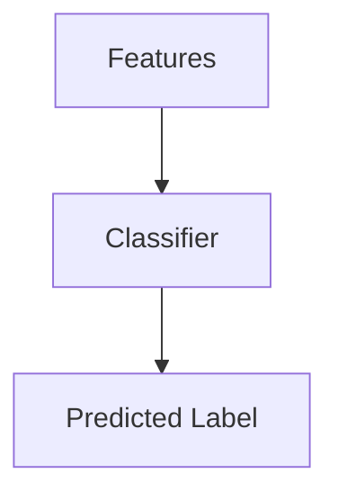
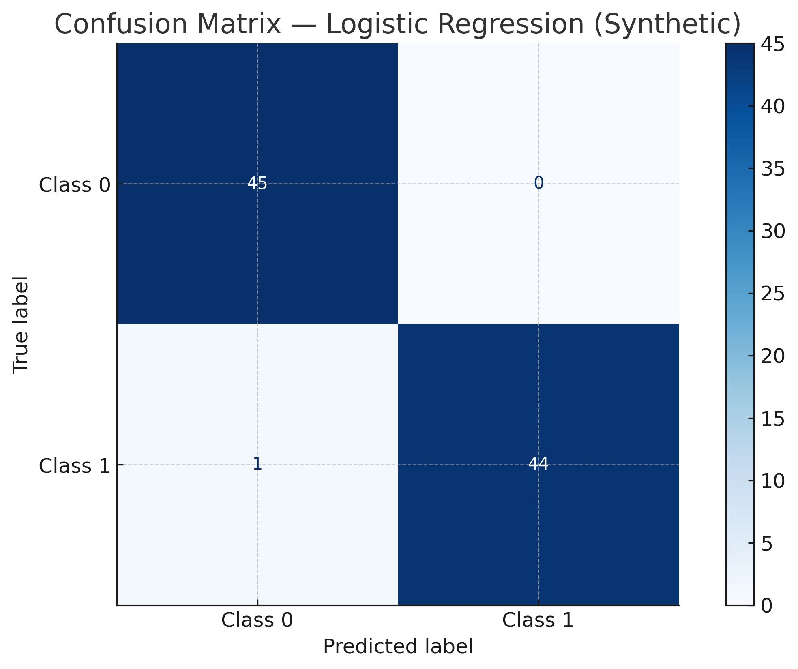
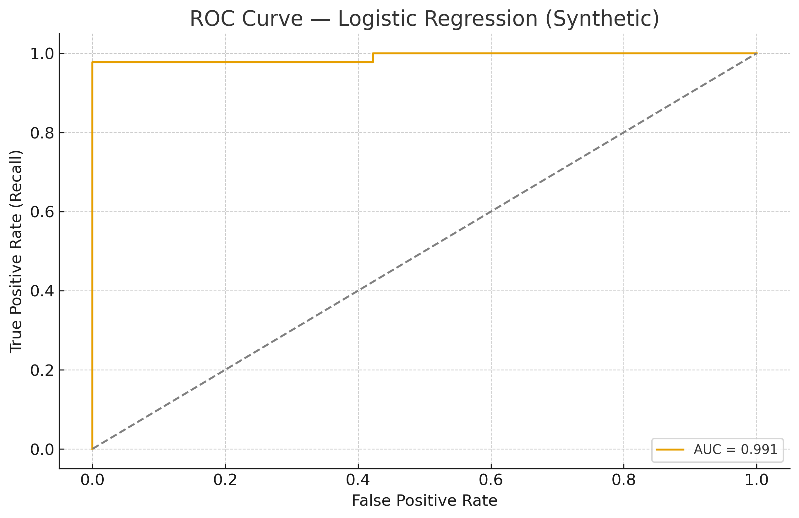

# 🤖 Chapter 15 — Classification

> Principles of classification, **Confusion Matrix**, **Precision**, **Recall**, **F1**, and **AUC–ROC** with theory, math, a worked example.

---

## 1) Classification Principles

Classification predicts discrete labels by learning a function:
$$ f: \mathbb{R}^n \to \{1,2,\dots,K\},\qquad
f^* = \arg\min_f\; \mathbb{E}_{(x,y)}[L(y,f(x))]. $$

**Binary** setup uses a score \(s(x)\) and threshold \(\tau\):
$$ \hat y = \begin{cases}
1,& s(x)\ge \tau \\
0,& s(x)<\tau
\end{cases}
$$

---

## 2) Confusion Matrix

|               | Predicted + | Predicted - |
|---------------|-------------|-------------|
| **Actual +**  | True Positive (TP) | False Negative (FN) |
| **Actual -**  | False Positive (FP) | True Negative (TN) |

Derived rates:
$$ \text{TPR}=\frac{TP}{TP+FN}\quad(\text{Recall}),\qquad
\text{FPR}=\frac{FP}{FP+TN}.
$$

**By‑hand example:** TP=8, FP=2, TN=7, FN=3  
Accuracy=0.75, Precision=0.80, Recall=0.727, F1≈0.762

**Visualization (synthetic):**  

---

## 3) Precision, Recall, F1

\[
\text{Precision}=\frac{TP}{TP+FP},\quad
\text{Recall}=\frac{TP}{TP+FN},\quad
F_1=2\cdot\frac{PR}{P+R}.
\]

When to favor each: Precision (costly FP), Recall (costly FN), F1 (balance).

---

## 4) ROC Curve and AUC

Vary \(\tau\) to get points \((\text{FPR}(\tau),\text{TPR}(\tau))\) forming the ROC curve.  
**AUC** = area under ROC; probability a random positive is ranked above a random negative.

**Visualization (synthetic):**  

---

## 6) Practice Questions

1. Derive Precision, Recall, and F1 from the confusion matrix.  
2. Explain why AUC is threshold‑independent.  
3. Compare ROC and Precision–Recall curves.  
4. Why can accuracy be misleading for imbalanced datasets?  
5. Show how moving the decision threshold affects Precision and Recall.

---
