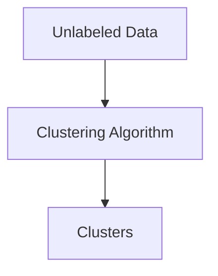
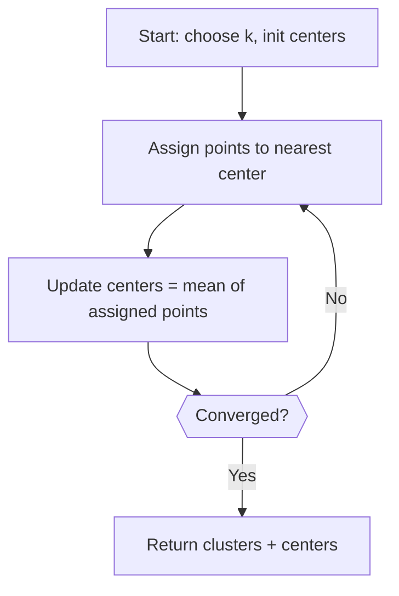
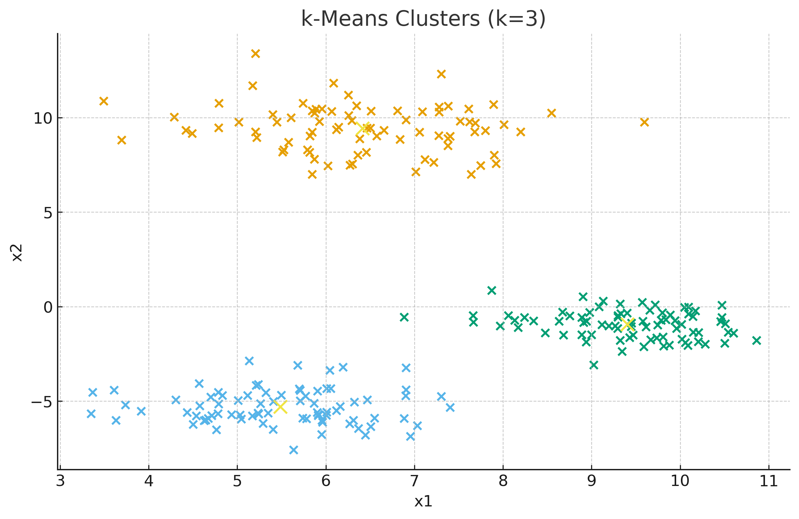
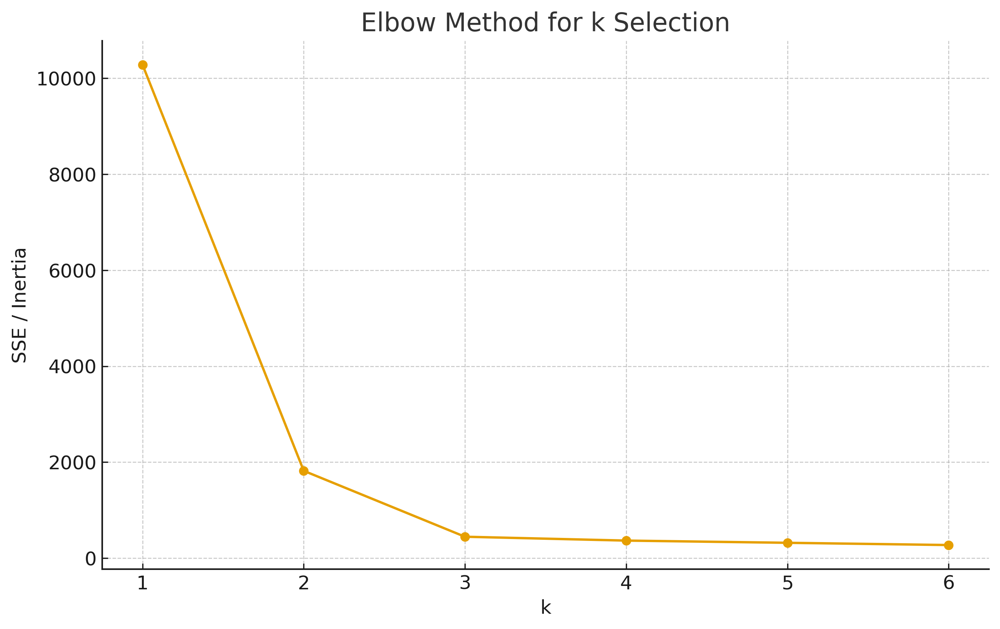

# 🧩 Chapter 16 — Clustering

> Principles of clustering, **k-Means** algorithm (math + by-hand example), and **evaluation metrics** (SSE/Inertia, Silhouette, Davies–Bouldin).

---

## 1) Clustering Principles

**Goal:** Group data into clusters so that **within-cluster** points are similar and **between-cluster** points are dissimilar.

### Similarity / Distance

Common choice for numeric data is **Euclidean distance**:

$$d(\mathbf x_i,\mathbf x_j)=\lVert \mathbf x_i-\mathbf x_j\rVert_2
= \sqrt{{\sum_{p=1}^P (x_{ip}-x_{jp})^2}}. $$

---

## 2) k-Means: Objective and Algorithm

### 2.1 Objective
Given data \(X=\{\mathbf x_i\}_{i=1}^n\), partition into \(k\) clusters with centers \( \{\boldsymbol\mu_c\}_{c=1}^k \) by minimizing:

$$\text{SSE} = \sum_{c=1}^k \ \sum_{\mathbf x_i \in C_c} \lVert \mathbf x_i - \boldsymbol\mu_c \rVert^2. $$

### 2.2 Alternating Minimization
- **Assignment step:** assign each point to nearest center  
  \( r_{ic} = 1 \) if \( c = \arg\min_j \lVert \mathbf x_i - \boldsymbol\mu_j \rVert \), else \(0\).
- **Update step:** update each center to the mean of its assigned points  
  \( \boldsymbol\mu_c = \frac{1}{|C_c|}\sum_{\mathbf x_i\in C_c}\mathbf x_i \).

Repeat until assignments stop changing or SSE converges.

  

### 2.3 By‑hand Mini Example (2D, k=2)
Points: \( (0,0),(1,0),(0,1), (5,5),(6,5),(5,6) \).  
Init centers: \( \mu_1=(0,0), \mu_2=(5,5) \).  
- Assign first 3 near \( \mu_1 \), last 3 near \( \mu_2 \).  
- Update: \( \mu_1=(\tfrac{1}{3},\tfrac{1}{3}), \mu_2=(\tfrac{16}{3},\tfrac{16}{3}) \).  
- Reassign → unchanged ⇒ converged.

---

## 3) Evaluation Parameters & Metrics

### 3.1 SSE / Inertia
\( \text{SSE} \) is the within-cluster sum of squared distances. Lower is better (for fixed \(k\)).  
Used by the **Elbow method**: plot SSE vs \(k\) and look for a “knee” where marginal gain drops.

### 3.2 Silhouette Coefficient
For point \(i\):  
\( a(i) \) = average distance to points in its own cluster;  
\( b(i) \) = minimum average distance to other clusters.  
Silhouette:
$$
s(i)=\frac{b(i)-a(i)}{\max\{a(i),\,b(i)\}}\in[-1,1].
$$
Overall score is the mean \(s(i)\). Higher is better.

### 3.3 Davies–Bouldin (DB) Index
For cluster \(c\), let \(S_c\) be average distance of points in \(c\) to center \(\mu_c\); and \(M_{cd}=\lVert \mu_c-\mu_d\rVert\).  
For each \(c\), compute \(R_{cd}=\frac{S_c+S_d}{M_{cd}}\) for \(d\ne c\), then
$$
\text{DB}=\frac{1}{k}\sum_{c=1}^k \max_{d\ne c} R_{cd}.
$$
Lower DB is better (compact & well-separated clusters).

---

## 4) Visualizations (Synthetic 2‑D)

### 4.1 k-Means Clusters (k=3)

### 4.2 Elbow Method

---

## 6) Practice Questions

1. Show that the k-Means center update is the mean of assigned points by minimizing SSE.  
2. For the by-hand two‑cluster example, compute SSE after convergence.  
3. Compare the effect of Euclidean vs Manhattan distance for k-Means assignments.  
4. Why can Silhouette be misleading for non‑convex clusters? Suggest an alternative.  
5. Use the Elbow and Silhouette methods together to choose \(k\).

---

