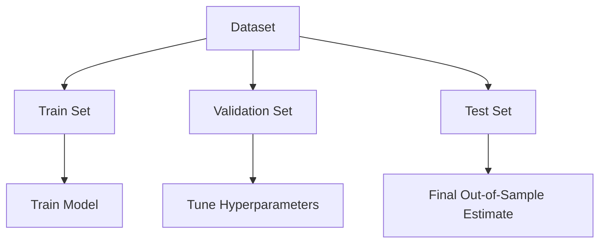
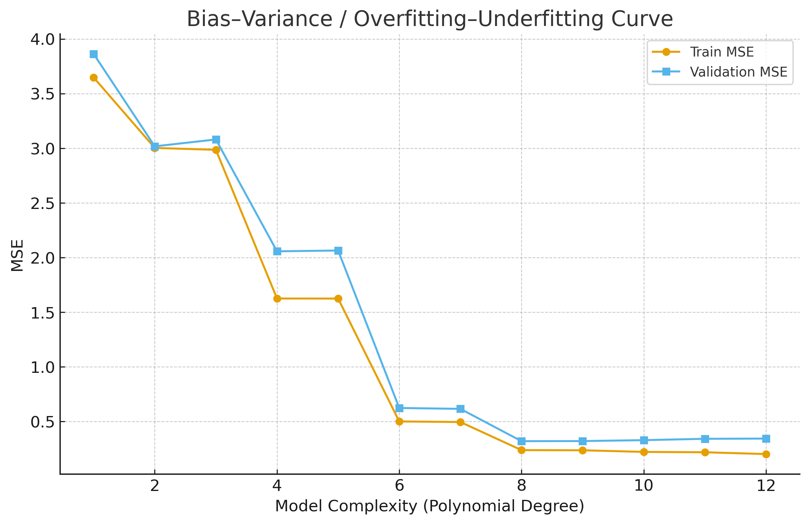
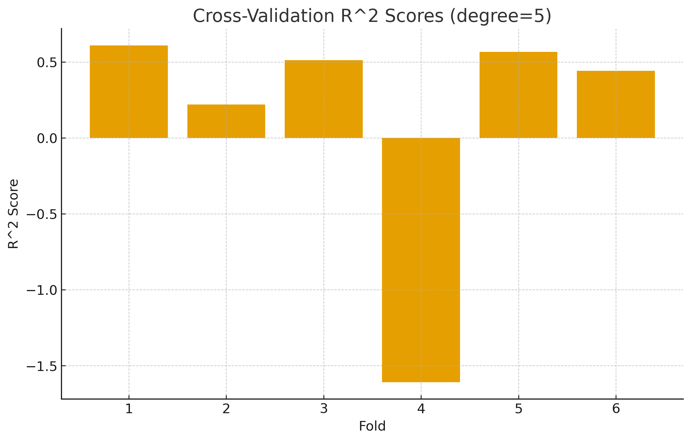

# 🎯 Chapter 17 — Model Evaluation

> **Generalization error, out-of-sample evaluation, overfitting vs underfitting, cross-validation, and metrics for both regression and classification.**
> Includes **math**, **worked examples**, **Mermaid diagrams**.

---

## 1) Generalization Error & Out-of-Sample Evaluation

**Goal:** Estimate how well a model will perform on **unseen data**.

Let data distribution be \(\mathcal{D}\) and loss \(L\). The **generalization error** of a learned predictor \(\hat f\) is:

$$\mathcal{E}_{\text{gen}}(\hat f) = \mathbb{E}_{(x,y)\sim \mathcal{D}}[L(y, \hat f(x))].
$$

Since \(\mathcal{D}\) is unknown, we estimate with a **test set**:

$$\hat{\mathcal{E}}_{\text{test}}(\hat f) = \frac{1}{m} \sum_{i=1}^{m} L(y_i, \hat f(x_i)).
$$

---

## 2) Bias–Variance Tradeoff (Regression)

For squared loss:

$$\mathbb E[(y-\hat f(x))^2] = (\mathbb E[\hat f(x)] - f(x))^2 + \mathbb Var[\hat f(x)] + \sigma^2.
$$

- **Underfitting** → high bias, low variance (too simple).  
- **Overfitting** → low bias, high variance (too complex).

**Visualization:**  

---

## 3) Evaluation Metrics

### 3.1 Regression Metrics

| Metric | Formula | Interpretation |
|---------|----------|----------------|
| **MAE** | \(\frac{1}{n}\sum_i\|y_i - \hat y_i\|\) | Average absolute error |
| **MSE** | \(\frac{1}{n}\sum_i (y_i - \hat y_i)^2\) | Penalizes large errors |
| **RMSE** | \(\sqrt{\text{MSE}} \) | Root of MSE |
| **R²** | \( 1 - \frac{\sum_i (y_i-\hat y_i)^2}{\sum_i (y_i-\bar y)^2}\) | Variance explained |

**Manual example (tiny):**  
True: [2, 3, 5, 4, 7], Pred: [2.0, 3.1, 4.2, 5.3, 6.4] → MAE=0.56, MSE=0.54, RMSE≈0.73, R²≈0.82

---

### 3.2 Classification Metrics

Confusion matrix (binary):

|               | Predicted + | Predicted - |
|---------------|-------------|-------------|
| **Actual +**  | **TP**      | **FN**      |
| **Actual -**  | **FP**      | **TN**      |

- **Accuracy**: \( \frac{TP+TN}{TP+FP+TN+FN} \)  
- **Precision**: \( \frac{TP}{TP+FP} \)  
- **Recall (TPR)**: \( \frac{TP}{TP+FN} \)  
- **F1**: \( 2\cdot \frac{PR}{P+R} \)  
- **AUC**: area under ROC curve (threshold-independent).

---

## 4) Cross-Validation

**k‑Fold Cross Validation:** Divide data into *k* folds; train on *k−1* and validate on the remaining fold.

$$\hat S_{\text{CV}} = \frac{1}{k}\sum_{j=1}^k S(\hat f^{(-j)}, V_j)
$$

- **Stratified CV:** keeps class balance (classification).  
- **LOOCV:** each fold has one sample; high variance.

**Visualization:**  

---

## 5) Overfitting vs Underfitting – Quick Guide

| Situation | Train Error | Validation Error | Description |
|------------|--------------|------------------|--------------|
| **Underfitting** | High | High | Model too simple |
| **Overfitting** | Low | High | Model too complex |
| **Good Fit** | Low | Low | Balanced generalization |

---

## 6) Practice Questions

1. Derive the **bias–variance decomposition** for squared loss.  
2. Explain why test data must remain **untouched** until final evaluation.  
3. Demonstrate **k-fold CV** on small data by hand.  
4. Compute Accuracy, Precision, Recall, and F1 from a confusion matrix.  
5. Explain how cross-validation mitigates overfitting.

---

