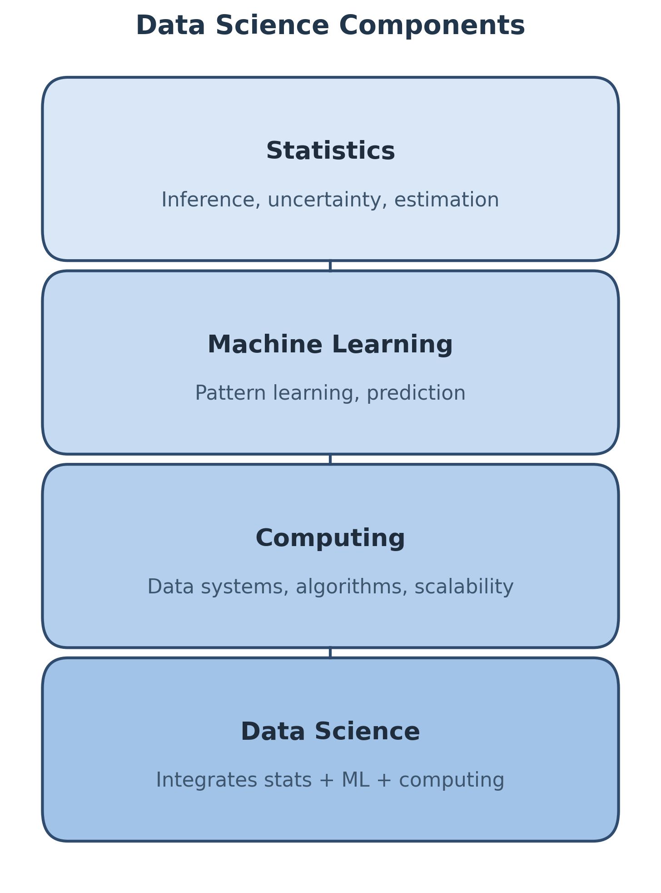
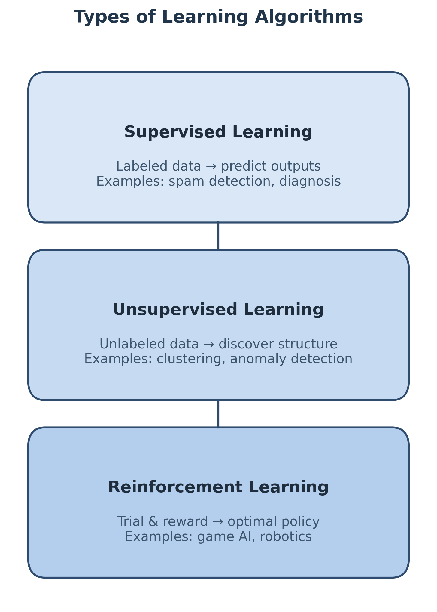
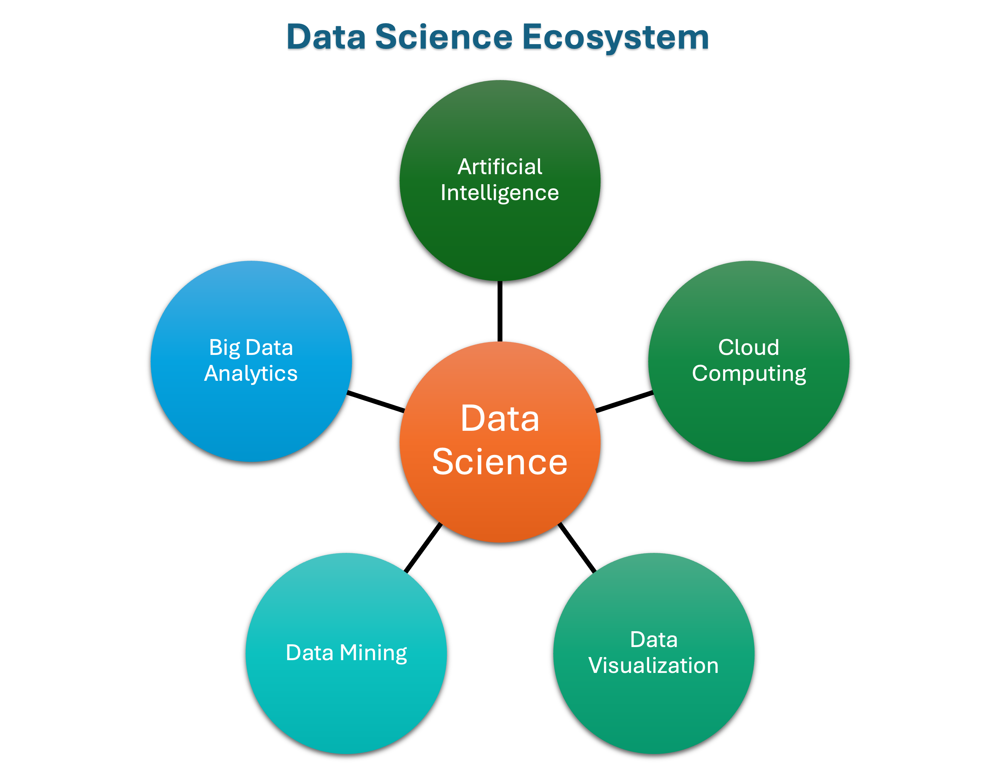

# 📘 Chapter 2 — What is Data Science

> Data Science is the discipline that integrates **statistics**, **machine learning**, and **computing** to extract knowledge and insights from data.

---

## 1. Definition of Data Science

**Data Science** is the study of methods and systems to extract *meaningful patterns* and *actionable insights* from structured and unstructured data.  
It unites principles from **mathematics**, **statistics**, **information theory**, and **computer science**.

In simple form, Data Science seeks a mapping:

\[ f: X \rightarrow Y \]

where:
- \(X\) = input or feature space  
- \(Y\) = target or outcome  
- \(f\) = learned model or pattern  
- \(\varepsilon\) = random error or noise

---

## 2. Extracting Meaningful Patterns

Data scientists explore and analyze large datasets to uncover relationships, trends, and anomalies.  
Examples include:
- Detecting fraudulent credit card transactions  
- Identifying customer segments in marketing  
- Finding associations between genes and diseases

The process involves:
1. Collecting and cleaning data  
2. Identifying variables and correlations  
3. Building models that generalize from examples

\[ Y = f(X) + \varepsilon \]

---

## 3. Building Representative Models

A **representative model** captures essential relationships within the data without memorizing noise.  
The goal is to generalize — to perform well not only on training data but also on unseen data.

**Steps in model building:**
1. Define the problem  
2. Select appropriate algorithms  
3. Train and validate the model  
4. Evaluate with metrics such as accuracy, MSE, or AUC  

---

## 4. Combination of Disciplines

Data Science combines three core disciplines that together enable data-driven decision-making.

| Discipline | Role |
|-------------|------|
| **Statistics** | Understanding data distribution, inference, hypothesis testing |
| **Machine Learning** | Building predictive and adaptive models |
| **Computing** | Efficient data storage, processing, and algorithmic implementation |

---

## 5. Learning Algorithms

Learning algorithms form the heart of Data Science. They can be grouped into three major categories:

### 🧩 Supervised Learning
- Learns from labeled data (known input–output pairs)  
- **Goal:** Predict new outputs for unseen inputs  
- **Examples:**  
  - Spam detection  
  - Medical diagnosis  
  - Sentiment classification  

### 🔍 Unsupervised Learning
- Works on unlabeled data to find hidden structure  
- **Goal:** Discover natural patterns or clusters  
- **Examples:**  
  - Customer segmentation  
  - Topic modeling  
  - Anomaly detection  

### 🎮 Reinforcement Learning
- Learns by interacting with an environment and receiving feedback (rewards)  
- **Goal:** Learn optimal actions over time  
- **Examples:**  
  - Game-playing AI  
  - Autonomous robots  
  - Recommendation tuning  

---

## 6. Associated Fields

Data Science intersects with several related areas that extend its capabilities.

| Field | Connection to Data Science |
|--------|-----------------------------|
| **Artificial Intelligence** | Broader goal of building intelligent systems |
| **Data Mining** | Focuses on pattern discovery in large datasets |
| **Big Data Analytics** | Handles high-volume, high-velocity data streams |
| **Cloud Computing** | Provides scalable data storage and computation |
| **Data Visualization** | Transforms analysis results into human-interpretable visuals |

---

## 7. Key Takeaways

- Data Science integrates **mathematics, statistics, and computing** for data-driven discovery.  
- The process involves **extracting patterns**, **building models**, and **deploying insights**.  
- It relies on **learning algorithms** that can generalize from data.  
- Data Science is both **a science** (theory, inference) and **an engineering practice** (implementation, scalability).  

---

## 📚 Suggested Reading

- *The Elements of Statistical Learning* — Hastie, Tibshirani, and Friedman  
- *Data Science for Business* — Provost and Fawcett  
- *Python for Data Analysis* — Wes McKinney  

---
