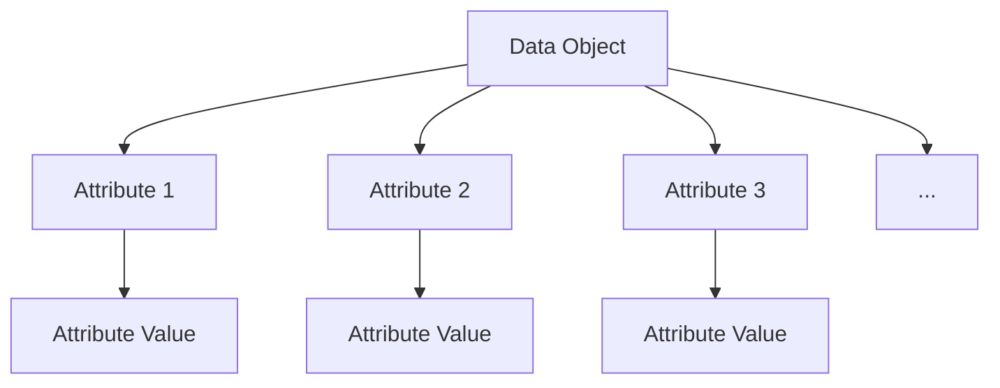
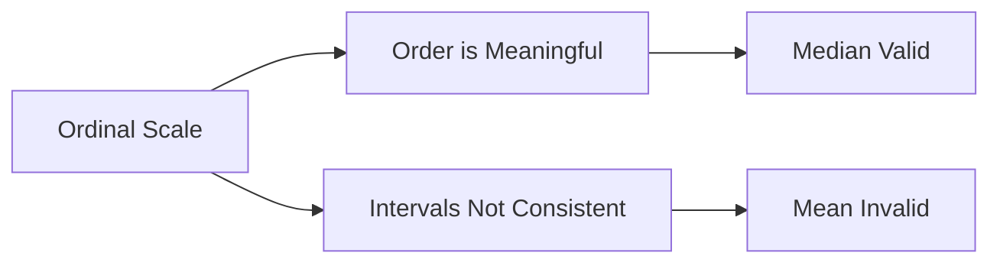
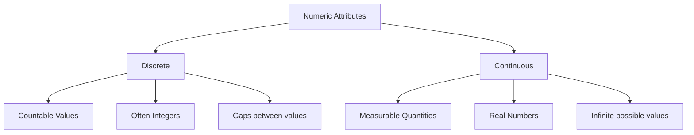
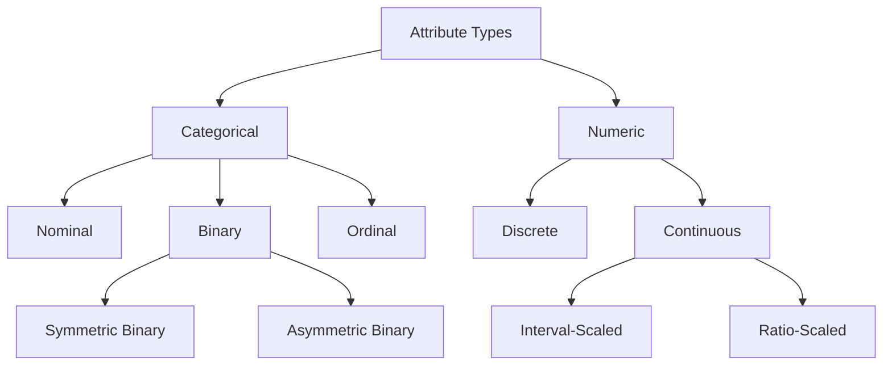
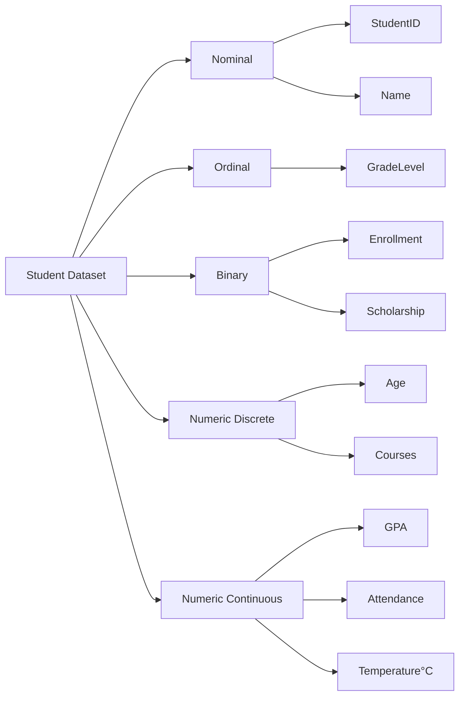

# Chapter 3: Data Objects and Attribute Types

## What Is an Attribute?

### Definition
An **attribute** (also known as feature, variable, or field) is a data field that represents a characteristic or property of a data object.

### Mathematical Representation
For a dataset with *n* objects and *m* attributes, we can represent it as:

\[ D = \{x_1, x_2, ..., x_n\} \]

where each object $x_i$ is represented as:

\[ x_i = (x_{i1}, x_{i2}, ..., x_{im}) \]

Here, \( x_{ij} \) represents the value of the *j*-th attribute for the *i*-th object.

### Key Terminology
- **Data Object**: Represents an entity (e.g., a customer, product, transaction)
- **Attribute**: Property or characteristic of an object
- **Attribute Value**: The actual measurement or observation

## Nominal Attributes

### Definition
Nominal attributes represent categories or states without any inherent ordering.

### Properties
- Symbolic values with no numerical significance
- No ordering between values
- Only equality operations are meaningful (=, ≠)
- Also called categorical or qualitative attributes

### Mathematical Representation
For a nominal attribute *A* with *k* possible values:

\[ A \in \{v_1, v_2, ..., v_k\} \]

where the only valid operations are:
- $v_i = v_j$
- $v_i \neq v_j$

### Examples

| Attribute | Possible Values |
|-----------|----------------|
| Color | {Red, Blue, Green, Yellow} |
| Gender | {Male, Female, Other} |
| Country | {USA, Canada, UK, Japan} |
| Product Category | {Electronics, Clothing, Food} |

### Statistical Operations
- **Valid**: Mode, frequency, contingency tables
- **Invalid**: Mean, median, standard deviation

## Binary Attributes

### Definition
Binary attributes are a special case of nominal attributes with exactly two possible values.

### Types of Binary Attributes

#### 1. Symmetric Binary
- Both values equally important
- No preference between outcomes
- Examples:
  - Gender: {Male, Female}
  - Coin Flip: {Heads, Tails}
  - Switch: {On, Off}

#### 2. Asymmetric Binary
- One outcome is more significant or important
- Typically coded as 1 (presence) and 0 (absence)
- Examples:
  - Medical Test: {Positive, Negative}
  - Disease: {Yes, No}
  - Feature Presence: {1, 0}

### Mathematical Representation
\[ A \in \{0, 1\} \text{ or } A \in \{\text{false}, \text{true}\} \]

## Ordinal Attributes

### Definition
Ordinal attributes have a meaningful order or ranking among values, but the differences between values are not quantifiable.

### Properties
- Order matters but intervals are not consistent
- Comparison operations are meaningful (<, >, =)
- Differences between values cannot be measured precisely

### Mathematical Representation
For an ordinal attribute *A*:

\[v_1 \prec v_2 \prec ... \prec v_n \]

where $\prec$ represents the ordering relationship.

### Examples

| Attribute | Ordered Values |
|-----------|---------------|
| Education Level | {High School ≺ Bachelor's ≺ Master's ≺ PhD} |
| Customer Rating | {Poor ≺ Fair ≺ Good ≺ Very Good ≺ Excellent} |
| Size | {Small ≺ Medium ≺ Large ≺ X-Large} |
| Economic Status | {Low ≺ Middle ≺ High} |

### Statistical Operations
- **Valid**: Mode, median, percentiles, rank correlation
- **Invalid**: Mean, standard deviation (intervals not consistent)

## Numeric Attributes

### Definition
Numeric attributes are quantitative and represent measurable quantities.

### Types of Numeric Attributes

#### 1. Interval-Scaled
- Measured on a scale with equal units
- No true zero point
- Differences are meaningful, ratios are not
- Examples:
  - Temperature in °C or °F
  - Calendar years
  - IQ scores
- Operations:
  - Differences are meaningful: 100°C - 90°C = 10°C
  - Ratios are not: 100°C is not twice as hot as 50°C

#### 2. Ratio-Scaled
- Has a true zero point
- Both differences and ratios are meaningful
- Examples:
  - Height, Weight, Age
  - Income, Sales
  - Counts, Duration
- Operations:
  - 100kg is twice as heavy as 50kg
  - 0kg means complete absence of weight

### Mathematical Properties
For ratio-scaled attributes *A* and *B*:

- *A + B* is meaningful
- *A - B* is meaningful
- *A × B* is meaningful
- *A / B* is meaningful

## Discrete vs Continuous Attributes

### Discrete Attributes

#### Definition
Attributes with a finite or countably infinite set of values.

#### Characteristics
- Countable set of values
- Often integer values
- Gaps between possible values

#### Mathematical Representation $$ A \subseteq \mathbb{Z} (integers) $$

#### Examples
- Number of children: {0, 1, 2, 3, ...}
- Number of cars: {0, 1, 2, ...}
- Shoe size: {6, 6.5, 7, 7.5, ...}
- Defect count: {0, 1, 2, ...}

### Continuous Attributes

#### Definition
Attributes with real numbers as values, forming an infinite, uncountable set.

#### Characteristics
- Measurable quantities
- Real number values
- Infinite possible values between any two points

#### Mathematical Representation\[A \subseteq \mathbb{R} \text{ (real numbers)\[

#### Examples
- Height: 175.3 cm, 182.7 cm, ...
- Weight: 68.5 kg, 72.1 kg, ...
- Temperature: 21.5°C, 22.3°C, ...
- Time: 3.25 seconds, 4.78 seconds, ...

## Attribute Type Hierarchy

## Summary Table

| Attribute Type | Ordering | Differences | Ratios | Zero Point | Examples |
|----------------|----------|-------------|--------|------------|----------|
| Nominal | No | No | No | No | Color, Gender |
| Binary | No | No | No | No | Yes/No, On/Off |
| Ordinal | Yes | No | No | No | Size, Rating |
| Discrete | Yes | Yes | Yes | Yes | Child count, Shoe size |
| Continuous Interval | Yes | Yes | No | No | Temperature °C |
| Continuous Ratio | Yes | Yes | Yes | Yes | Height, Weight |

## Key Mathematical Concepts

### Measurement Scales
The hierarchy of measurement scales from weakest to strongest:
1. **Nominal** - equality only
2. **Ordinal** - equality + ordering
3. **Interval** - equality + ordering + differences
4. **Ratio** - equality + ordering + differences + ratios

### Permissible Statistics
For each attribute type, different statistical operations are meaningful:

| Operation | Nominal | Ordinal | Interval | Ratio |
|-----------|---------|---------|----------|-------|
| Frequency | ✓ | ✓ | ✓ | ✓ |
| Mode | ✓ | ✓ | ✓ | ✓ |
| Median | ✗ | ✓ | ✓ | ✓ |
| Mean | ✗ | ✗ | ✓ | ✓ |
| Standard Deviation | ✗ | ✗ | ✓ | ✓ |
| Ratio | ✗ | ✗ | ✗ | ✓ |

## Practical Considerations

### Data Preprocessing
Understanding attribute types is crucial for:
- **Encoding**: One-hot encoding for nominal, label encoding for ordinal
- **Normalization**: Different techniques for different numeric types
- **Visualization**: Appropriate plots for each attribute type
- **Analysis**: Valid statistical tests and operations

### Machine Learning Implications
- **Nominal**: Use one-hot encoding or embedding layers
- **Ordinal**: Can use integer encoding with preserved order
- **Numeric**: May require scaling/normalization
- **Binary**: Can be used directly or with specific loss functions

## Mini Dataset Example — Student Records

### Dataset Description
Consider the following student records dataset containing 8 students with various attributes:

| StudentID | Name | Age | GPA | GradeLevel | Enrollment | Courses | Scholarship | Attendance | Temperature°C |
|-----------|------|-----|-----|------------|------------|---------|-------------|------------|---------------|
| S001 | Alice | 20 | 3.75 | Junior | Full-time | 5 | Yes | 95.2% | 22.5 |
| S002 | Bob | 22 | 3.20 | Senior | Part-time | 3 | No | 87.8% | 23.1 |
| S003 | Charlie | 19 | 2.90 | Sophomore | Full-time | 4 | No | 92.5% | 21.8 |
| S004 | Diana | 21 | 3.95 | Junior | Full-time | 5 | Yes | 98.1% | 22.9 |
| S005 | Eve | 23 | 3.10 | Senior | Part-time | 3 | Yes | 85.4% | 23.5 |
| S006 | Frank | 20 | 2.75 | Sophomore | Full-time | 4 | No | 89.7% | 22.2 |
| S007 | Grace | 19 | 3.85 | Freshman | Full-time | 5 | Yes | 96.3% | 21.5 |
| S008 | Henry | 21 | 3.45 | Junior | Part-time | 4 | No | 91.0% | 22.7 |

### Attribute Type Analysis

#### 1. StudentID
- **Type**: Nominal
- **Reason**: Unique identifier with no mathematical meaning
- **Valid Operations**: Equality checks only

#### 2. Name
- **Type**: Nominal
- **Reason**: Text labels with no inherent order
- **Valid Operations**: Equality checks, string matching

#### 3. Age
- **Type**: Numeric, Discrete, Ratio-scaled
- **Reason**: Whole numbers, true zero point, ratios meaningful
- **Valid Operations**: All arithmetic operations
- **Example**: 20 years is twice 10 years

#### 4. GPA
- **Type**: Numeric, Continuous, Interval-scaled
- **Reason**: Real numbers, but no true zero (GPA of 0 doesn't mean "no academic performance")
- **Valid Operations**: Differences meaningful, ratios not meaningful

#### 5. GradeLevel
- **Type**: Ordinal
- **Reason**: Ordered categories (Freshman ≺ Sophomore ≺ Junior ≺ Senior)
- **Valid Operations**: Comparisons, median, percentiles

#### 6. Enrollment
- **Type**: Binary (Symmetric)
- **Reason**: Two mutually exclusive categories
- **Valid Operations**: Frequency, mode

#### 7. Courses
- **Type**: Numeric, Discrete, Ratio-scaled
- **Reason**: Countable integers, true zero point
- **Valid Operations**: All arithmetic operations

#### 8. Scholarship
- **Type**: Binary (Asymmetric)
- **Reason**: Two categories, "Yes" is typically more significant
- **Valid Operations**: Frequency, mode

#### 9. Attendance
- **Type**: Numeric, Continuous, Ratio-scaled
- **Reason**: Percentage measurements, true zero point (0% means no attendance)
- **Valid Operations**: All arithmetic operations

#### 10. Temperature°C
- **Type**: Numeric, Continuous, Interval-scaled
- **Reason**: Temperature measurements, no true zero (0°C doesn't mean no temperature)
- **Valid Operations**: Differences meaningful, ratios not meaningful

### Visualization by Attribute Type

### Statistical Analysis Examples

#### For Nominal Attributes (Name):
- **Valid**: Frequency count of names
- **Invalid**: Average name, standard deviation of names

#### For Ordinal Attributes (GradeLevel):
- **Valid**: Median grade level, mode
- **Invalid**: Average grade level (Freshman=1, Sophomore=2, etc.)

#### For Numeric Ratio (Age):
- **Valid**: Mean age = 20.6 years, Age range = 19-23 years
- **Valid Ratio**: 23 years is approximately 1.21 times 19 years

#### For Numeric Interval (GPA):
- **Valid**: Mean GPA = 3.37, GPA difference between Alice and Bob = 0.55
- **Invalid**: Alice's GPA is NOT 1.17 times Bob's GPA

## Practice Questions

### Multiple Choice Questions

1. **Which attribute type allows for meaningful calculation of mean and standard deviation?**
   - A) Nominal
   - B) Ordinal
   - C) Binary
   - D) Numeric Ratio-scaled
   
   **Answer**: D

2. **Temperature in Celsius is an example of:**
   - A) Nominal attribute
   - B) Ordinal attribute
   - C) Interval-scaled attribute
   - D) Ratio-scaled attribute
   
   **Answer**: C

3. **Which operation is valid for ordinal attributes but not for nominal attributes?**
   - A) Frequency count
   - B) Mode calculation
   - C) Median calculation
   - D) Equality comparison
   
   **Answer**: C

### Identification Exercises

Identify the attribute type for each of the following:

1. **Social Security Number**
   - **Answer**: Nominal (unique identifier)

2. **Military Rank (Private, Corporal, Sergeant, Lieutenant)**
   - **Answer**: Ordinal (clear hierarchy)

3. **Number of siblings**
   - **Answer**: Numeric, Discrete, Ratio-scaled

4. **Blood Type (A, B, AB, O)**
   - **Answer**: Nominal (categories with no order)

5. **Likert Scale (Strongly Disagree to Strongly Agree)**
   - **Answer**: Ordinal (ordered categories with unequal intervals)

### Dataset Analysis Exercise

Given this product dataset, identify each attribute's type:

| ProductID | Category | Price | Size | InStock | CustomerRating | Weight | Color |
|-----------|----------|-------|------|---------|----------------|--------|-------|
| P1001 | Electronics | 599.99 | Large | Yes | 4.5 | 2.3 | Black |
| P1002 | Clothing | 49.99 | Medium | No | 3.8 | 0.5 | Blue |

**Answers:**
- **ProductID**: Nominal
- **Category**: Nominal
- **Price**: Numeric, Continuous, Ratio-scaled
- **Size**: Ordinal
- **InStock**: Binary
- **CustomerRating**: Numeric, Continuous, Interval-scaled
- **Weight**: Numeric, Continuous, Ratio-scaled
- **Color**: Nominal

### True or False

1. **Binary attributes are a special case of nominal attributes.**
   - **Answer**: True

2. **For ordinal data, the difference between "Good" and "Very Good" is the same as between "Fair" and "Good".**
   - **Answer**: False

3. **Age can be treated as both discrete and continuous depending on context.**
   - **Answer**: True (discrete in years, continuous in precise measurement)

4. **The mean is a valid measure of central tendency for nominal data.**
   - **Answer**: False

### Calculation Practice

Using the Student Records dataset, calculate:

1. **Valid statistics for Age attribute:**
   - Mean: (20+22+19+21+23+20+19+21)/8 = 20.625 years
   - Median: 20.5 years
   - Mode: 20, 21 (bimodal)

2. **Valid statistics for GradeLevel:**
   - Mode: Junior (appears 3 times)
   - Invalid: Mean grade level

3. **Valid statistics for Scholarship:**
   - Frequency: Yes = 4, No = 4
   - Mode: Bimodal (both categories equally frequent)

### Critical Thinking Questions

1. **Why can't we calculate the average of nominal data like "Country"?**
   - **Answer**: Nominal values have no numerical significance or ordering, so mathematical operations like averaging are meaningless.

2. **When might you treat age as continuous instead of discrete?**
   - **Answer**: In medical studies or precise demographic analysis where exact age in years/months/days matters.

3. **What are the implications of misclassifying an ordinal attribute as nominal in machine learning?**
   - **Answer**: You lose valuable ordering information, potentially reducing model performance and interpretability.

4. **Why is temperature in Fahrenheit considered interval-scaled rather than ratio-scaled?**
   - **Answer**: Because 0°F doesn't represent an absolute absence of heat, making ratios meaningless (100°F isn't twice as hot as 50°F).

---

## Summary

Understanding attribute types is fundamental to data analysis and machine learning. Each attribute type has specific properties that determine:
- Which statistical operations are valid
- How to properly encode the data
- Which visualization techniques are appropriate
- What machine learning algorithms can be applied

Remember the key distinctions:
- **Nominal**: Categories without order
- **Ordinal**: Categories with meaningful order
- **Interval**: Numeric with consistent intervals but no true zero
- **Ratio**: Numeric with true zero and meaningful ratios
