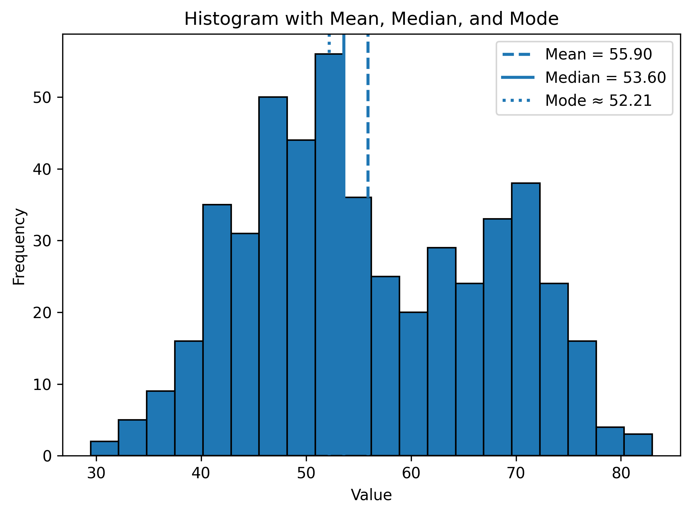
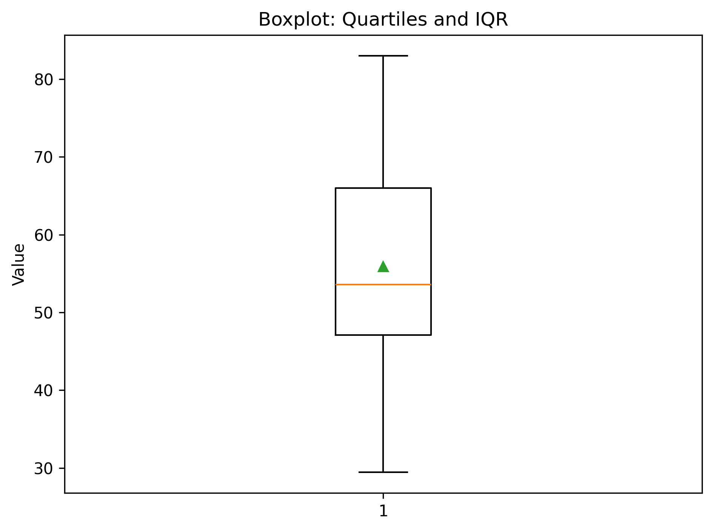
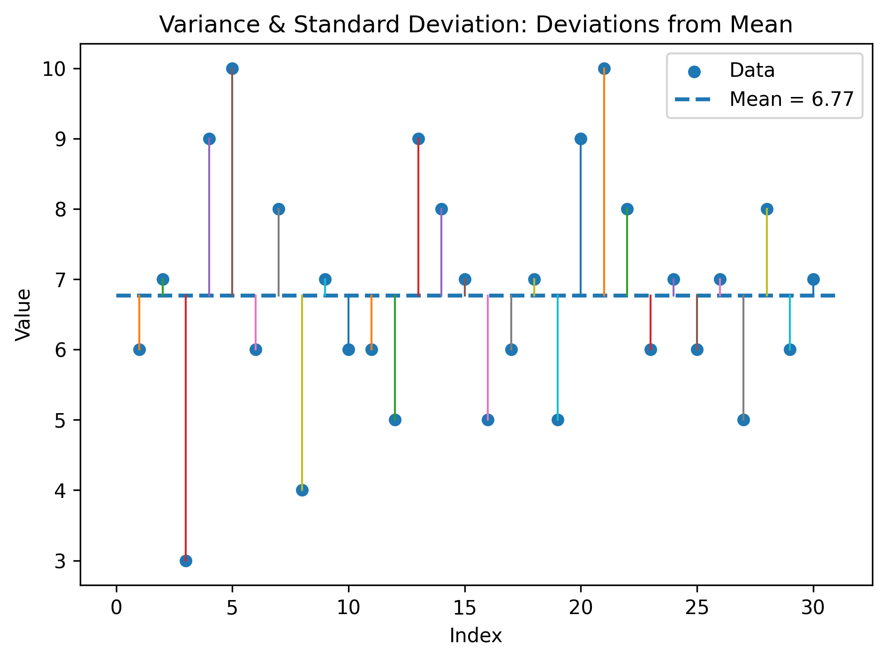

# 📘 Chapter 4 — Basic Statistical Descriptions of Data

> Measuring **central tendency** (Mean, Median, Mode) and **dispersion** (Range, Quartiles, Variance, Standard Deviation, Interquartile Range). Includes worked examples, formulas.

---

## 1. Central Tendency

### 1.1 Mean (Arithmetic Average)
For a sample \(x_1,\dots,x_n\), 

\[ \bar{x}=\frac{1}{n}\sum_{i=1}^{n} x_i. \]

### 1.2 Median (50th Percentile)
Middle value after sorting; for even \(n\), average the two middle values.

### 1.3 Mode
Most frequent value (or, for continuous data, the **modal bin** with highest frequency).

**Figure:** Histogram with mean/median/mode markers  

---

## 2. Dispersion of Data

### 2.1 Range

\[
\text{Range} = \max(x) - \min(x).
\]

### 2.2 Quartiles & IQR
Quartiles \(Q_1, Q_2, Q_3\) split the ordered data into four parts.  
Interquartile Range (IQR):

\[
\text{IQR} = Q_3 - Q_1.
\]

**Figure:** Boxplot with quartiles and whiskers  

### 2.3 Variance & Standard Deviation
Sample variance \(s^2\) and standard deviation \(s\):

\[
s^2 = \frac{1}{n-1}\sum_{i=1}^{n}(x_i-\bar{x})^2,
\qquad
s = \sqrt{s^2}.
\]

**Figure:** Deviations from the mean (visualizing variance & std)  

---

## 3. Worked Numerical Example (by hand)

Given the sample (n=10):  
\(\{6,\, 7,\, 3,\, 9,\, 10,\, 6,\, 8,\, 4,\, 7,\, 6\}\)

1. **Sort:** \( \{3,4,6,6,6,7,7,8,9,10\} \)  
2. **Mean:** \( \bar{x}=\frac{3+4+6+6+6+7+7+8+9+10}{10}=6.6 \)  
3. **Median:** average of 5th & 6th elements \( \Rightarrow (6+7)/2=6.5 \)  
4. **Mode:** 6 (most frequent)  
5. **Range:** \(10-3=7\)  
6. **Quartiles (Tukey):**  
   - \(Q_1=\) median of lower half \(\{3,4,6,6,6\}=6\)  
   - \(Q_2=\) median \(=6.5\)  
   - \(Q_3=\) median of upper half \(\{7,7,8,9,10\}=8\)  
   - \(\text{IQR}=Q_3-Q_1=2\)  
7. **Variance & Std:** compute \(\sum (x_i-\bar{x})^2 = 46.4\)  
   - \(s^2 = 46.4/(10-1) \approx 5.156\)  
   - \(s \approx 2.271\)

---

## 4. Practice Questions

1. Prove that the mean minimizes the sum of squared deviations \( \sum (x_i - c)^2 \).  
2. Show, by example, a dataset where mean ≠ median due to skewness.  
3. Compare **IQR** vs **standard deviation** as dispersion measures for heavy‑tailed data.  
4. For a bimodal distribution, discuss the usefulness of “mode” and propose alternatives.

---

