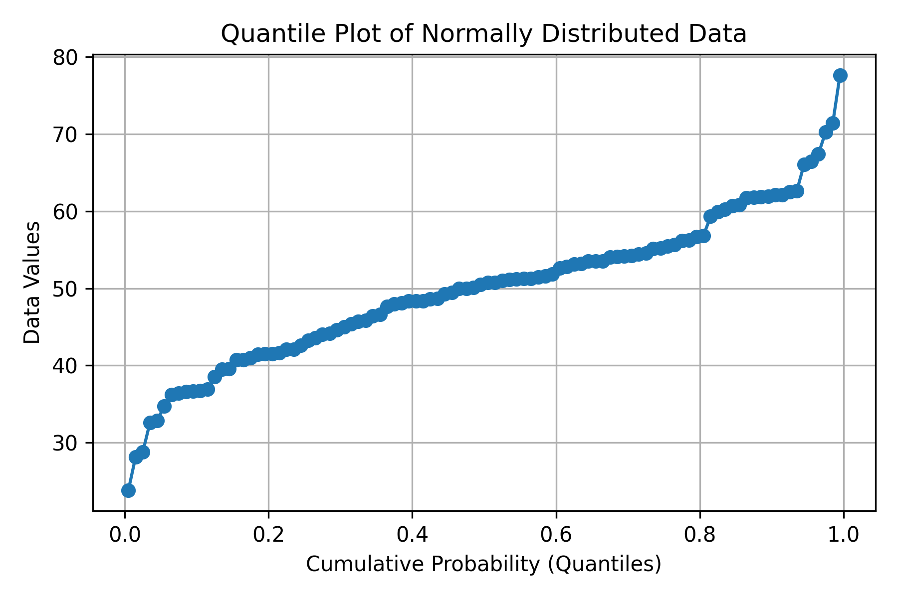
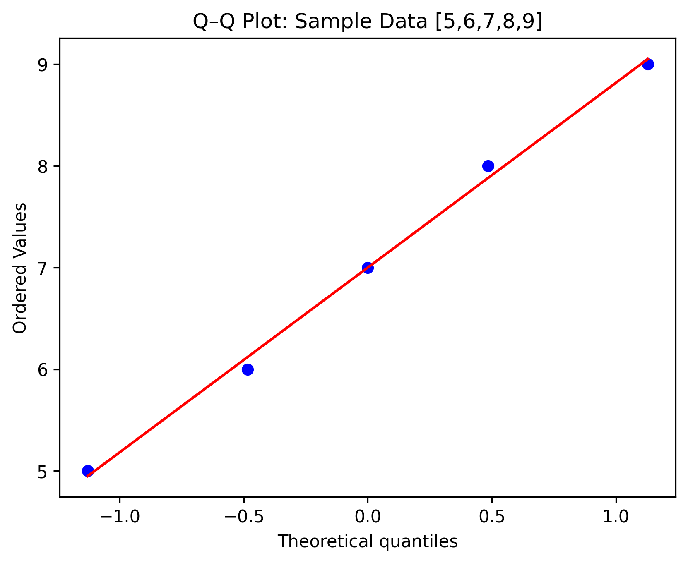

# 📊 Graphic Displays of Basic Statistical Descriptions of Data

## 🎯 Objective
To understand and visualize basic statistical descriptions of data using graphical methods such as:

- Quantile Plot  
- Quantile-Quantile (Q-Q) Plot  
- Histogram  
- Quartile Plot (Box Plot)  
- Distribution Chart (Density Plot / KDE)

---

##  Quantile Plot

### ✳️ Definition
A **quantile plot** displays the ordered data against their **cumulative probabilities**.  
It helps visualize how data values are distributed and whether they deviate from a uniform or theoretical distribution.

### 📐 Formula
For ordered data values  \( x_{(1)} \le x_{(2)} \le ... \le x_{(n)} \) :  

\[ p_i = \frac{i - 0.5}{n} \]

Each data point is plotted as $( (p_i, x_{(i)}) )$.

### 🧮 Manual Example
Given data: [10, 12, 15, 18, 20]

| i | x(i) | p = (i-0.5)/n |
|---|------|----------------|
| 1 | 10 | 0.1 |
| 2 | 12 | 0.3 |
| 3 | 15 | 0.5 |
| 4 | 18 | 0.7 |
| 5 | 20 | 0.9 |

Plot these \( (p, x) \) points to get the quantile plot.

---

##  Quantile–Quantile (Q–Q) Plot

### ✳️ Definition
A **Q–Q plot** compares the quantiles of the sample data with those of a **theoretical distribution** (usually normal).  

### 🧮 Manual Example
Given sample data: [5, 6, 7, 8, 9] (n=5)

Step 1: Compute ordered z-values (theoretical quantiles for normal distribution).  

For i = 1 to n:

$[ p_i = \frac{i - 0.5}{n} ]$

| i | Data \( x_i \)| \( p_i \) | \( z(p_i) \) from Z-table |
|---|------------|------|--------------------|
| 1 | 5 | 0.1 | -1.28 |
| 2 | 6 | 0.3 | -0.52 |
| 3 | 7 | 0.5 | 0.00 |
| 4 | 8 | 0.7 | 0.52 |
| 5 | 9 | 0.9 | 1.28 |

Plot \( (z, x) \). If points form a straight line, data ~ Normal.

---

## 🧩 References

1. Tukey, J. W. (1977). *Exploratory Data Analysis*. Addison-Wesley.  
2. Cleveland, W. S. (1993). *Visualizing Data*. Hobart Press.  
3. Seaborn Documentation: https://seaborn.pydata.org  
4. Matplotlib Documentation: https://matplotlib.org

---
