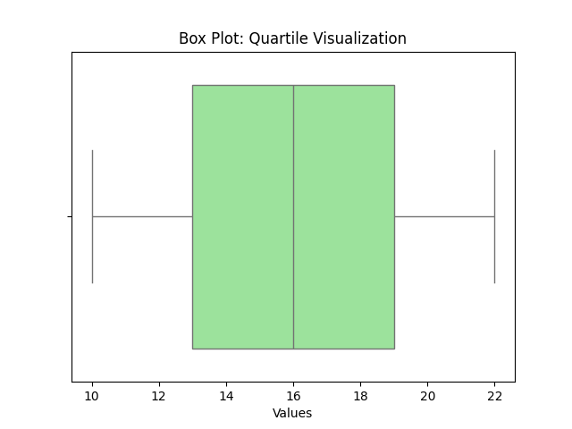

## 1. Histogram

### ✳️ Definition
A histogram shows **frequency distribution** of data grouped into **bins**.

🧮 Formula

Frequency in bin 𝑖

 \( f_𝑖 \) = Number of observations in bin 𝑖 

### 🧮 Manual Example
Data: [2, 3, 3, 4, 5, 6, 7, 8, 8, 9]

Bin width = 2  
Bins: (2–4), (4–6), (6–8), (8–10)

| Bin | Frequency |
|------|------------|
| 2–4 | 3 |
| 4–6 | 2 |
| 6–8 | 3 |
| 8–10 | 2 |

Plot bars with heights as frequencies.

## 2. Box Plot (Quartile Visualization)

### ✳️ Definition
A box plot summarizes data based on **five-number summary**:

$$\text{Minimum, Q1, Median, Q3, Maximum}$$

### 🧮 Manual Example
$$data: [10, 12, 14, 16, 18, 20, 22]$$

$$n = 7$$  

$$Median = 16  $$

$$Q1 = 12 + (14-12)*0.5 = 13  $$

$$Q3 = 20 + (22-20)*0.5 = 21$$

$$Five-number\quad summary = (10, 13, 16, 21, 22)$$

Draw box from Q1–Q3, line at Median, whiskers to min & max.

<

---

## 3. Distribution Chart (KDE Plot)

### ✳️ Definition
A **KDE plot** estimates probability density by smoothing the histogram.

## i) What is KDE?

Given a univariate sample $(x_1,\dots,x_n)$, the KDE at a point $(x)$ is

$$\hat f_h(x) \;=\; \frac{1}{n h}\sum_{i=1}^n K\!\left(\frac{x-x_i}{h}\right)$$

where:
- $(K(\cdot))$ is a kernel (e.g., Gaussian, Epanechnikov, Uniform, Triangular), $(\int K(u)\,du=1)$,

- $(h>0)$ is the **bandwidth** (smoothing parameter).

**Intuition.** Each observation contributes a small “bump” centered at $(x_i)$; the final curve is their average. Smaller $(h)$ → more wiggly; larger $(h)$ → smoother.

---

## ii) Common Kernels (closed forms)

- **Gaussian:** $(K(u)=\dfrac{1}{\sqrt{2\pi}}e^{-u^2/2})$

- **Epanechnikov:** $(K(u)=\dfrac{3}{4}(1-u^2)\mathbf{1}\{|u|\le 1\})$

- **Uniform (Rectangular):** $(K(u)=\dfrac12\mathbf{1}\{|u|\le 1\})$

- **Triangular:** $(K(u)=(1-|u|)\mathbf{1}\{|u|\le 1\})$

> In practice, the **bandwidth** matters more than the specific kernel choice for smooth densities.

---

## iii) Manual Example A — Gaussian kernel, explicit numbers

**Dataset:** $(x=\{4,5,6,7,8\})$ (so $(n=5)$).  

Useful Gaussian values (to 6 d.p.):
$\phi(0)=0.398942,\phi(0.5)=0.352065,\phi(1)=0.241971$

$\phi(1.5)=0.129518,\phi(2)=0.053991,\phi(2.5)=0.017528$

$\phi(3)=0.004432,\phi(4)=0.000134.$

### A1) KDE at $(x=6)$ with bandwidth $(h=1)$

Standardized offsets $(u_i=(x- x_i)/h)$: $((2,1,0,-1,-2))$.  

Contributions: $(\phi(2),\phi(1),\phi(0),\phi(1),\phi(2))$.  

$\sum \phi = 0.053991 + 0.241971 + 0.398942 + 0.241971 + 0.053991 = 0.990866.$

$\hat f_{h=1}(6) = \frac{1}{n h}\sum \phi = \frac{0.990866}{5\cdot 1} = \boxed{0.198173}.$

### A2) KDE at $(x=5)$ with $(h=1)$

Offsets $(u=(1,0,-1,-2,-3))$ → $(\phi(1)+\phi(0)+\phi(1)+\phi(2)+\phi(3))$.

$\sum \phi = 0.241971 + 0.398942 + 0.241971 + 0.053991 + 0.004432 = 0.941307.$

$\hat f_{h=1}(5) = \frac{0.941307}{5} = \boxed{0.188261}.$

### A3) Effect of bandwidth at $(x=6)$

- $(h=0.5)$: $(u=(4,2,0,-2,-4))$ → $(\phi(4)+\phi(2)+\phi(0)+\phi(2)+\phi(4))$  

  $(\sum \phi = 0.000134 + 0.053991 + 0.398942 + 0.053991 + 0.000134 = 0.507192)$.  

  $(\hat f = \dfrac{1}{n h}\sum = \dfrac{0.507192}{5\cdot 0.5} = \boxed{0.202877})$.

- $(h=2)$: $(u=(1,0.5,0,-0.5,-1))$ → $(\phi(1)+\phi(0.5)+\phi(0)+\phi(0.5)+\phi(1))$ 

  $(\sum \phi = 0.241971 + 0.352065 + 0.398942 + 0.352065 + 0.241971 = 1.587014)$.  

  $(\hat f = \dfrac{1.587014}{5\cdot 2} = \boxed{0.158701})$.

**Observation.** Increasing $(h)$ lowered the peak (more smoothing). Decreasing $(h)$ raised the peak/sharpness.

---

## iv) Manual Example B — Epanechnikov kernel, $(h=1)$

At $(x=6)$: $(u=(2,1,0,-1,-2))$. Only $(|u|\le 1)$ contribute: $(u=1,0,-1)$. 

$(K(1)=0,\;K(0)=\tfrac34,\;K(-1)=0)$.  

$\sum K = 0 + 0.75 + 0 = 0.75,\quad \hat f = \frac{0.75}{n h} = \frac{0.75}{5\cdot 1} = \boxed{0.15}.$

---

## v) Choosing Bandwidth by Hand (closed‑form rules)

Let $(s)$ be sample standard deviation; $(\text{IQR}=Q_3-Q_1)$. 

Define $(n^{-1/5})$ (for $(n=5)$, $(n^{-1/5}\approx 0.72478)$).

- **Scott’s rule (Normal reference):**
$h_{\text{Scott}} = 1.06\, s\, n^{-1/5}.$

- **Silverman’s rule of thumb:**
$h_{\text{Silv}} = 0.9\;\min\!\left(s, \frac{\text{IQR}}{1.34}\right)\! n^{-1/5}.$

**For our dataset** \( x=\{4,5,6,7,8\} \):  
- Mean \(=6 \). Using sample SD: $(s=\sqrt{\tfrac{\sum(x_i-6)^2}{n-1}}=\sqrt{\tfrac{10}{4}}=1.58114)$ 

- Quartiles (hinges): $(Q_1\approx 5,\; Q_3\approx 7 \Rightarrow \text{IQR}=2)$, $(\text{IQR}/1.34=1.49254)$. 

- $(n^{-1/5}\approx 0.72478)$.

Hence,
$h_{\text{Scott}} \approx 1.06\times 1.58114 \times 0.72478 = \boxed{1.215},$

$h_{\text{Silv}} \approx 0.9\times \min(1.58114,\,1.49254)\times 0.72478 = 0.9\times 1.49254 \times 0.72478 \approx \boxed{0.973}.$

---

## vi) Hand‑Computation Template (exam‑ready)

**Input:** sample $(x_1,\dots,x_n)$, kernel $(K)$, bandwidth $(h)$, target evaluation point $(x^\star)$.  
**Steps:**  
1. Compute offsets $(u_i=\dfrac{x^\star - x_i}{h})$. 

2. For each $(u_i)$, evaluate $(K(u_i))$ (using table/known values).  

3. Sum: $(S=\sum_{i=1}^n K(u_i))$.  

4. Output: $(\hat f(x^\star)=\dfrac{S}{n h})$.  

5. Repeat for a grid of $(x^\star)$ to sketch the curve by hand.

---

## vii) Worked Mini‑Grid (Gaussian, $(h=1)$)

Dataset as before. Evaluate $(\hat f(x))$ at $(x=\{5,6,7\})$.  
Because of symmetry, $(\hat f(5)=\hat f(7))$.

| $(x)$ | Offsets $(u)$ for $(\{4,5,6,7,8\})$ | Sum of $(\phi(u))$ | $(\hat f(x)=\dfrac{1}{5}\sum \phi(u))$ |
|---|---|---:|---:|
| 5 | (1,0,-1,-2,-3) | 0.941307 | **0.188261** |
| 6 | (2,1,0,-1,-2) | 0.990866 | **0.198173** |
| 7 | (3,2,1,0,-1)  | 0.941307 | **0.188261** |

---

## viii) Comparing KDE vs Histogram (manual)

Same data, bins of width 2: (2–4], (4–6], (6–8], (8–10]  
Frequencies: 0, 2, 3, 0 → bars at 0, 2, 3, 0.  
KDE is **smooth** and does **not depend on bin edges**; histogram **does**.

---

## ix) Boundary Bias & Discrete Data

- For supports like $([0,\infty))$, Gaussian kernels “spill” mass into negatives near 0. Fixes: boundary‑corrected kernels, reflection, or transformation (e.g., log).  
- KDE assumes continuous data; for discrete/integer data, consider **jittering** or **discrete kernels**.

---

## x) Multimodality by Hand (quick check)

If data cluster near two centers, KDE will show two peaks **when $(h)$** is small enough to resolve them. Try two clusters (e.g., $(\{0,0.2,0.1\}\cup\{3,3.1,3.2\})$) and compute at midpoints to see valley between modes.

---

## xi) Short Exam Problems (with answers)

**Q1.** For $(x=\{4,5,6,7,8\})$, Gaussian kernel, $(h=1)$, compute $(\hat f(6))$.  
**A.** $(0.1982)$ (from §3 A1).

**Q2.** Same data, Epanechnikov, $(h=1)$, compute $(\hat f(6))$.  
**A.** $(0.15)$ (from §4).

**Q3.** Using Silverman’s rule, approximate $(h)$.  
**A.** $(\approx 0.973)$ (from §5).

**Q4.** Explain effect of doubling $(h)$ on the KDE at a peak.  
**A.** Peak height typically decreases; curve becomes smoother (see §3 A3).

---

## xii) Quick Reference Values (Gaussian $(\phi(u))$)

$\small\begin{array}{c|cccccccc}
u & 0 & 0.5 & 1 & 1.5 & 2 & 2.5 & 3 & 4\\\hline
\phi(u) & 0.399 & 0.352 & 0.242 & 0.130 & 0.054 & 0.018 & 0.004 & 0.0001
\end{array}$

---

---

## Summary Table

| Visualization | Purpose | Manual Computation |
|----------------|----------|--------------------|
| Quantile Plot | Plot cumulative probabilities | (i-0.5)/n vs x(i) |
| Q–Q Plot | Compare data quantiles to theoretical | z-scores vs data |
| Histogram | Frequency count | Bin width, frequencies |
| Box Plot | Quartile-based summary | Min, Q1, Median, Q3, Max |
| KDE Plot | Smooth probability density | Kernel formula |

---

## 🧩 References

1. Tukey, J. W. (1977). *Exploratory Data Analysis*. Addison-Wesley.  
2. Cleveland, W. S. (1993). *Visualizing Data*. Hobart Press.  
3. Seaborn Documentation: https://seaborn.pydata.org  
4. Matplotlib Documentation: https://matplotlib.org

---