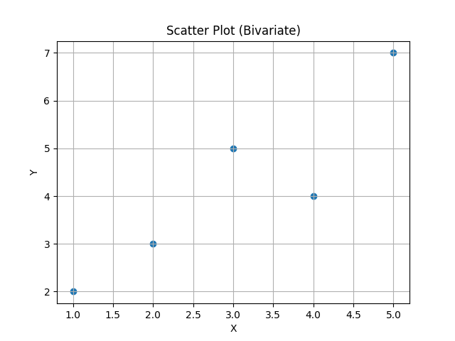
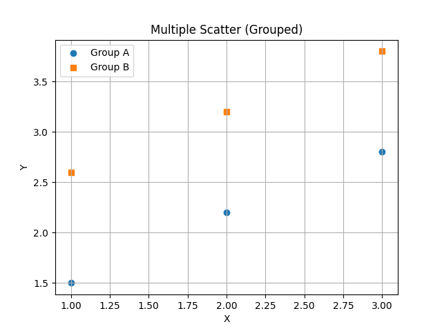

# 📊 Multivariate Visualization — Scatter Plot, Multiple Scatter, Bubble Chart, Density Chart

**Goal:** Provide PhD-level theory, math, hand-computable numerical examples.

- Scatter plot (bivariate)
- Scatter multiple (grouped scatter + scatter matrix)
- Bubble chart
- Density chart (2D KDE, contour, hexbin)

---

## 1) Scatter Plot (Bivariate)

### 1.1 Theory
A scatter plot shows paired observations $((x_i, y_i)
)$ as points in $(\mathbb{R}^2
)$. It reveals **association**, **trend**, **clusters**, and **outliers**.

**Pearson correlation (strength of linear association):**
$r=\frac{\sum_{i=1}^n (x_i-\bar x)(y_i-\bar y)}{\sqrt{\sum_{i=1}^n (x_i-\bar x)^2}\sqrt{\sum_{i=1}^n (y_i-\bar y)^2}}.$

### 1.2 Hand Numerical Example
Data (n=5):  
$(x=[1,2,3,4,5])$, $(y=[2,3,5,4,7])$.  

$(\bar x=3)$, $(\bar y=4.2)$.

Compute sums:  
$(\sum(x_i-\bar x)(y_i-\bar y)$ 
$\qquad\qquad\qquad = (−2)(−2.2)+(−1)(−1.2)+(0)(0.8)+(1)(−0.2)+(2)(2.8)$
$\qquad \qquad \qquad = 4.4+1.2+0−0.2+5.6=11.0)$  

$(\sum(x_i-\bar x)^2= 4+1+0+1+4=10)$
$(\sum(y_i-\bar y)^2= 4.84+1.44+0.64+0.04+7.84=14.8)$.  

$(r=11/\sqrt{10\cdot 14.8}=11/\sqrt{148}=11/12.165=0.904)$ (~).

---

## 2) Scatter Multiple

Two common meanings:

1) **Grouped scatter** (category-wise coloring/markers) to compare clusters/groups.  
2) **Scatter matrix** to view pairwise relationships across many variables.

### 2.1 Theory (Grouped Scatter)
Given groups $(g\in\{1,\dots,G\})$, plot $((x_i, y_i))$ with style/color by $(g_i)$. 
This reveals **between-group separation** and **within-group variance**.

### 2.2 Hand Numerical Example (Grouped)
Data with group labels:  

- Group A: $((1,1.5),(2,2.2),(3,2.8))$  
- Group B: $((1,2.6),(2,3.2),(3,3.8))$

Visual expectation: B sits above A (larger $(y)$ for same $(x)$).

### 2.4 Scatter Matrix (Pairwise Scatter for $(p)$ variables)

**Idea:** For a dataset $(X \in \mathbb{R}^{n\times p})$, visualize all $\binom{p}{2}$ pairs to assess linear/nonlinear relationships.

**Correlation matrix:** $(R = [r_{jk}]_{p\times p})$, where $(r_{jk})$ is Pearson correlation between $(X_{\cdot j}$ and $(X_{\cdot k})$.

---

## 3) Bubble Chart

### 3.1 Theory
A **bubble chart** extends scatter by mapping a third (and possibly fourth) variable to **marker size** (and color). For triplets $(x_i,y_i,s_i)$, bubble **area** is proportional to $(s_i)$ (not radius), i.e. marker size $(\propto s_i)$.

**Common scaling:** If $(s_i)$ are raw magnitudes, use size in points$(^2)$:  

$$size_i = \alpha \cdot \frac{s_i - \min s}{\max s - \min s + \epsilon} + \beta$$ 

to avoid vanishing/huge bubbles.

### 3.2 Hand Numerical Example
Data: $((x,y,s))$  
$((1,3,10), (2,4,30), (3,5,50))$. Let $(\alpha=1000)$, $(\beta=50)$, $(\epsilon=0)$.  
$(\min s=10, \max s=50)$.  
Normalized sizes:  
- for $(10)$: $(50)$ (smallest)  
- for $(30)$: $(50 + 1000\cdot (20/40)=50+500=550)$  
- for $(50)$: $(50 + 1000\cdot (40/40)=1050)$

---

## 4) Density Chart (2D Density: KDE, Contour, Hexbin)

### 4.1 Theory: 2D Kernel Density Estimation (Gaussian)
Given points $(\{ \mathbf{x}_i \}_{i=1}^n \subset \mathbb{R}^2)$, $(\mathbf{x}=(x,y))$, diagonal bandwidth $(H=\mathrm{diag}(h_x^2, h_y^2))$. The 2D Gaussian KDE is$ 

$\hat f(\mathbf{x})=\frac{1}{n\,2\pi h_x h_y}\sum_{i=1}^n \exp\!\left(-\tfrac{1}{2}\left[\left(\frac{x-x_{i}}{h_x}\right)^2+\left(\frac{y-y_{i}}{h_y}\right)^2\right]\right).$

Contours of $(\hat f(\mathbf{x}))$ yield 

**density/contour plots**; discretization via counts yields **hexbin**.

### 4.2 Hand Numerical Example (Evaluate KDE at one location)
Data $(n=3)$: $((0,0), (1,0), (0,1))$. 

Let $(h_x=h_y=1)$. 

Evaluate at $((x,y)=(0,0))$.  

Offsets and exponent terms:

- From $((0,0))$: exponent $(= -\tfrac{1}{2}(0^2+0^2)=0)$ → $(\exp(0)=1)$
- From $((1,0))$: exponent $(= -\tfrac{1}{2}((−1)^2+0^2)=-0.5)$ → $(e^{-0.5}=0.60653)$
- From $((0,1))$: exponent $(= -\tfrac{1}{2}(0^2+(−1)^2)=-0.5)$ → $(0.60653)$

Sum $(=1+0.60653+0.60653=2.21306)$.  

$\hat f(0,0)=\frac{1}{n\,2\pi h_x h_y}\sum \exp(\cdot)=\frac{2.21306}{3\cdot 2\pi\cdot 1\cdot 1}=\frac{2.21306}{18.8496}=\mathbf{0.1175}\;(\text{approx}).$

---

## 5) Practical Guidance (Exam Tips)
- **Scaling for bubble charts:** map **area** (not radius) to the magnitude.  
- **Overplotting:** use transparency (`alpha`), smaller markers, or hexbin/density.  
- **Correlation vs. Causation:** high $(r
)$ does not imply causality.  
- **Bandwidth choice (2D KDE):** start with $(h_x,h_y
)$ near the sample SDs times $(n^{-1/6}
)$ (2D analogue); adjust by visual diagnostics.  
- **Scatter matrix:** inspect both diagonal (univariate distributions) and off-diagonal (pairwise scatter).

---

## 6) References
- Tukey (1977), *Exploratory Data Analysis*.  
- Cleveland (1993), *Visualizing Data*.  
- Scott (2015), *Multivariate Density Estimation*.  
- Matplotlib documentation (Pairwise scatter & hexbin).

---
