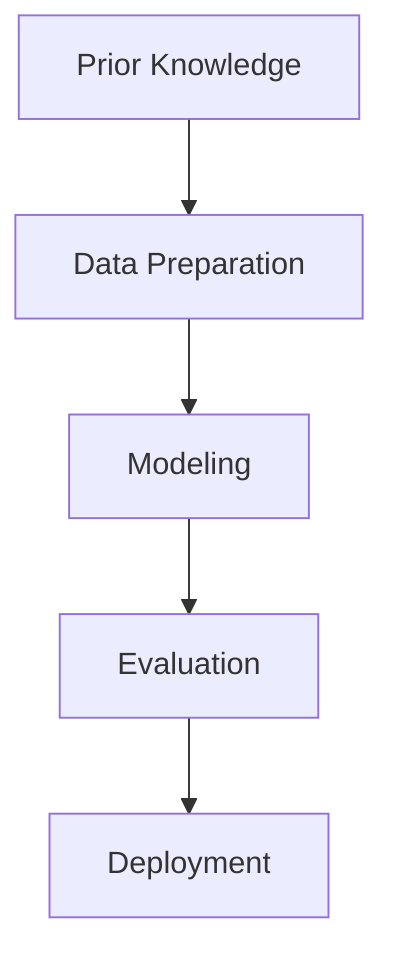
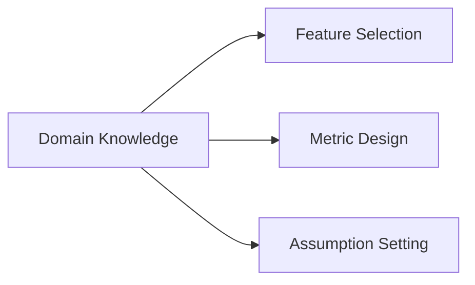
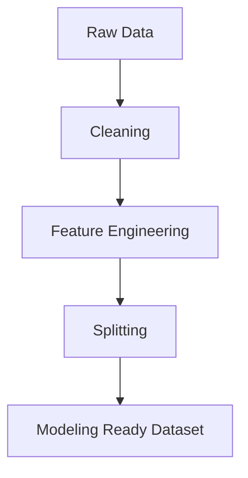
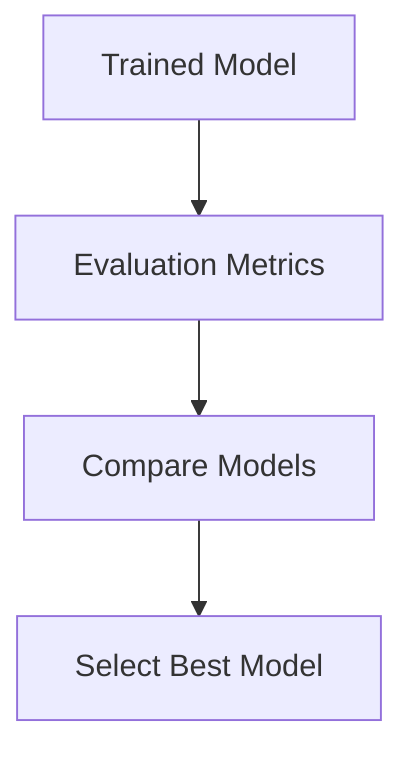
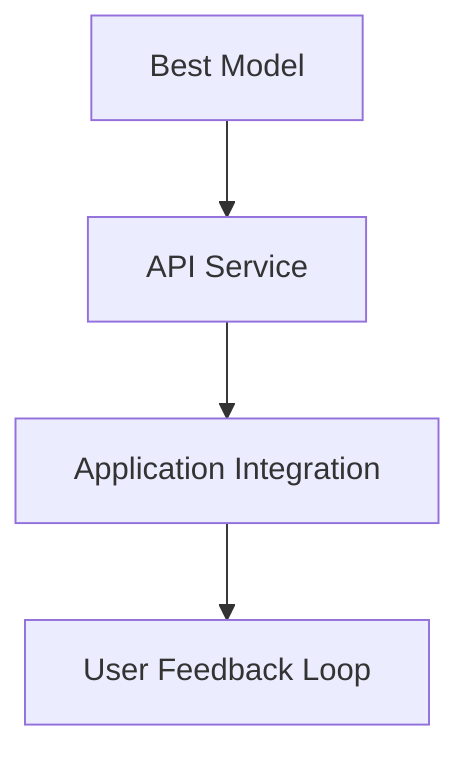
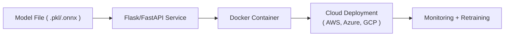
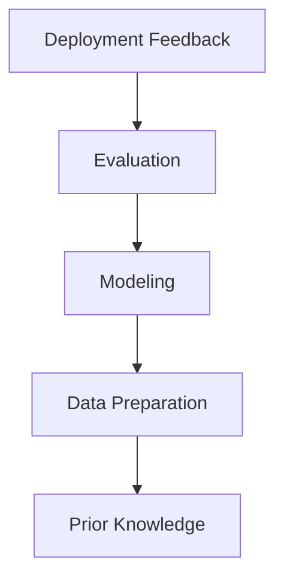

# 📊 Chapter 9 — Data Science Process

> A comprehensive overview of the end‑to‑end **Data Science Process**, from prior knowledge to deployment.

---

## 🔁 1. Overview

The **Data Science Process** transforms raw data into actionable insights through systematic stages:

Each stage iteratively refines understanding and improves decision quality.

---

## 🧠 2. Prior Knowledge

### Definition
- Domain expertise, business context, and problem framing.
- Hypotheses and expectations derived from experience or literature.

### Tasks
- Identify the **objective** (classification, regression, clustering, etc.).
- Define **target variable(s)**.
- Select **metrics** relevant to success.

### Example
> Suppose you’re building a **loan default prediction** model. Prior knowledge includes:
> - Customer demographics, credit history, and income behavior.
> - Bank risk policies.
> - Economic indicators.

---

## 🧹 3. Data Preparation

### Definition
Converting raw, messy data into a structured and analyzable form.

### Sub‑steps
1. **Data Collection:** from databases, APIs, logs, or files.
2. **Data Cleaning:** handle missing values, outliers, and duplicates.
3. **Feature Engineering:** derive new features, normalize, encode categorical variables.
4. **Splitting:** train, validation, and test sets.

### Example (by hand)
| Step | Action | Example |
|------|---------|----------|
| Missing | Replace null income | `income = mean(income)` |
| Outliers | Cap extreme age values | `age = min(age, 80)` |
| Encoding | Convert gender | `male→1, female→0` |

---

## 🧮 4. Modeling

### Definition
Selecting and training algorithms to represent data patterns.

### Types of Models
| Problem | Model Family | Example |
|----------|---------------|----------|
| Classification | Logistic Regression, Decision Tree, SVM | Predict customer churn |
| Regression | Linear, Ridge, Lasso, Random Forest | Predict house price |
| Clustering | K‑Means, DBSCAN | Group customers |
| Dimensionality Reduction | PCA, t‑SNE | Visualization |

### Mathematical Foundation (example)
For linear regression:

\[ \hat{y} = \beta_0 + \sum_{j=1}^p \beta_j x_j \]

- where $\boldsymbol{\beta} = (X^TX)^{-1}X^Ty$

---

## 📈 5. Evaluation

### Purpose
Assess model performance and generalization.

### Metrics
| Type | Metrics |
|------|----------|
| Classification | Accuracy, Precision, Recall, F1, ROC‑AUC |
| Regression | RMSE, MAE, $R^2$ |
| Clustering | Silhouette Score, Davies‑Bouldin Index |

### Example Calculation
For predictions: $[0.9, 0.3, 0.8, 0.1]$, actual: $[1,0,1,0]$  
Threshold = 0.5 → Predictions = [1,0,1,0] → **Accuracy = 100%**.

---

## 🚀 6. Deployment

### Definition
Integrating the trained model into a production environment.

### Methods
- **Batch inference:** periodic predictions (e.g., nightly).
- **Online inference:** real‑time API endpoint.
- **Edge deployment:** mobile or IoT model execution.

### Example Architecture

---

## 🔄 7. Iteration and Continuous Learning

The process is **cyclic** — feedback from deployment improves earlier stages.

---

## 🧩 8. Summary Table

| Stage | Key Actions | Tools |
|--------|--------------|-------|
| Prior Knowledge | Define objective, assumptions | Domain expertise, documentation |
| Data Preparation | Cleaning, transformation | Pandas, SQL, Excel |
| Modeling | Algorithm training | scikit‑learn, TensorFlow, PyTorch |
| Evaluation | Performance metrics | sklearn.metrics, visualization |
| Deployment | Serve models | Flask, FastAPI, Docker, AWS Sagemaker |

---

## 🧠 9. Quick Exam Questions

1. **Explain how domain knowledge impacts feature engineering.**  
2. **What are the differences between batch and online deployment?**  
3. **Which metric is suitable for imbalanced classification?**  
4. **Describe a feedback loop in deployed systems.**  
5. **Write the formula for a linear regression model.**  

---
