# 📘 Introduction to Data Science — Textbook

> A compact, classroom-ready textbook with **theory**, **by-hand examples**.

---

## 🎯 What you’ll learn

- Solid foundations of **Data Science**: concepts, math, and workflow
- **Visualization**: histograms, scatter, KDE, Q–Q, boxplots, multivariate charts
- **Modeling**: regression, classification, clustering, evaluation, cross-validation
- **Data preparation**: cleaning, integration, reduction, transformation, discretization
- **Hands-on**: Python code to **generate figures** used in the chapters

---

## Data Science Overview
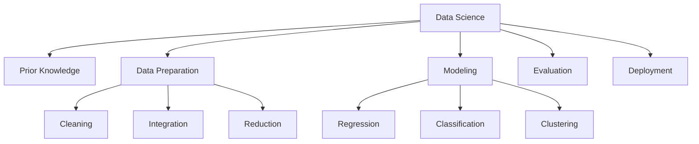

---

## 🗂️ How to use this site

- Use the **left navigation** to jump between chapters.
- Each chapter includes **formulas (MathJax)**, **diagrams (Mermaid/PNG)**, and **code snippets** to reproduce figures.
- Downloadable `.md` and `.png` are available where relevant for GitHub Pages hosting.

> 💡 Tip: Use the search box (⌘/Ctrl + K) to find formulas, terms, or figure names instantly.

---

## 📚 Chapters

- **Foundations**
  - [Chapter 1 — Introduction](Chapter1.md)  
  - [Chapter 2 — What is Data Science](Chapter2.md)  
  - [Chapter 3 — Data Objects and Attribute Types](Chapter3.md)  
  - [Chapter 4 — Basic Statistical Descriptions of Data](Chapter4.md)

- **Visualization**
  - [Chapter 5](Chapter5.md) · [Chapter 6](Chapter6.md) · [Chapter 7](Chapter7.md) · [Chapter 8](Chapter8.md)

- **Process & Preparation**
  - [Chapter 9](Chapter9.md) · [Chapter 10](Chapter10.md) · [Chapter 11](Chapter11.md) · [Chapter 12](Chapter12.md) · [Chapter 13](Chapter13.md)

- **Modeling & Evaluation**
  - [Chapter 14](Chapter14.md) · [Chapter 15](Chapter15.md) · [Chapter 16](Chapter16.md) · [Chapter 17](Chapter17.md)

---

## 🖼️ Plot Gallery (quick preview)

| Quantile | Histogram | Scatter |
|---|---|---|
|  | 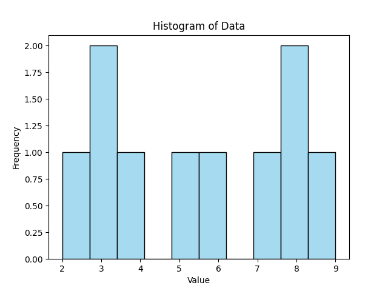 | 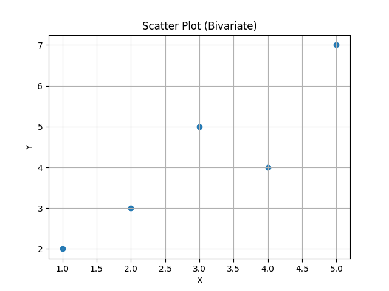 |

| Multi-Scatter | Scatter Matrix | Bubble |
|---|---|---|
| 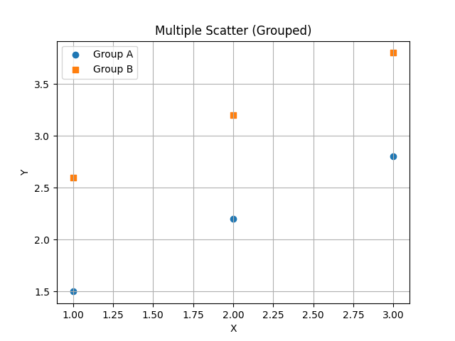 | 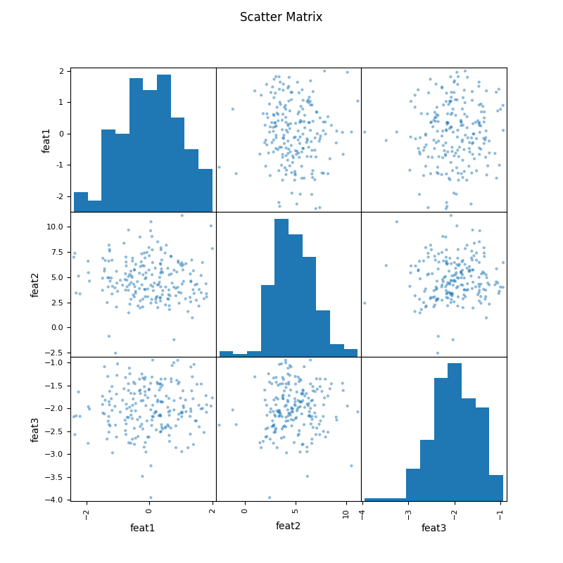 | 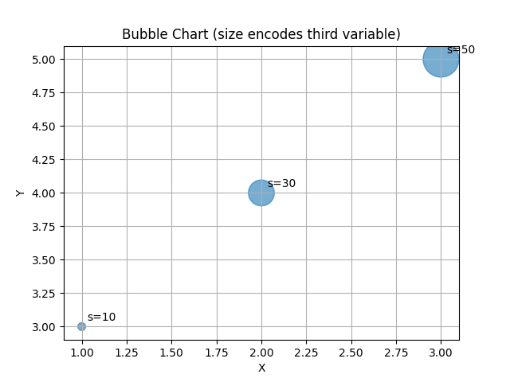 |

| KDE | Q–Q | Parallel Coordinates |
|---|---|---|
| 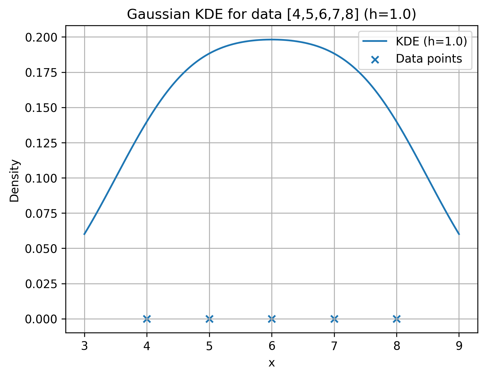 |  | 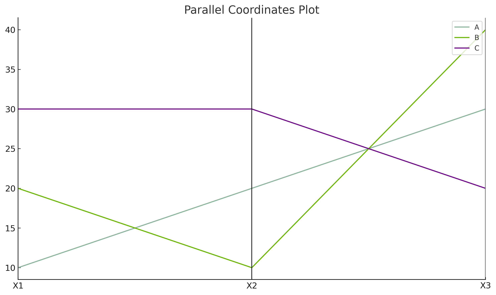 |

| Deviation | Andrews Curves | Box |
|---|---|---|
| 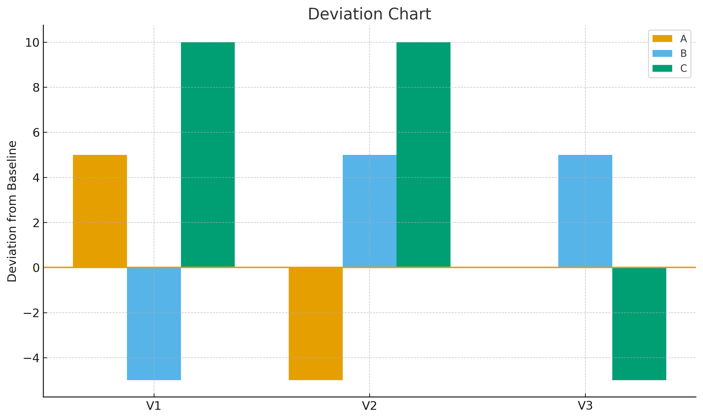 | 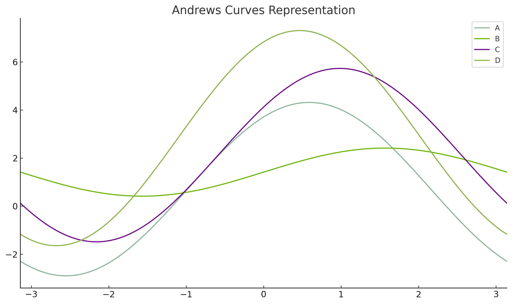 | 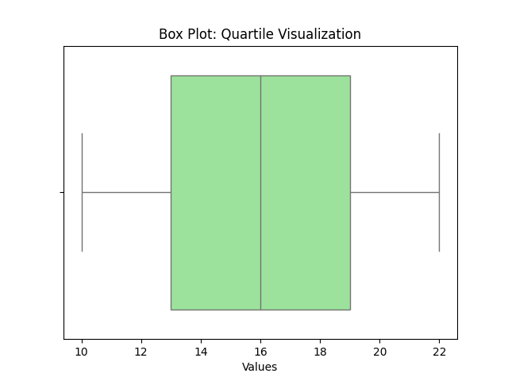 |

---

